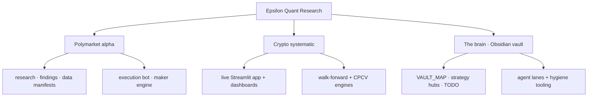

<h1 align="center">Epsilon — Quant Research</h1>

<p align="center">
  A quantitative research monorepo spanning <b>prediction-market microstructure</b> and <b>systematic crypto trading</b>,<br/>
  built on a self-documenting research knowledge base.
</p>

<p align="center">
  
  
  
  
  
</p>

---

## What's inside

This repo has **two main research branches** plus a shared knowledge layer:

1. **Polymarket** — prediction-market research and execution: copy-trading, market-making, binary-option/fair-value work, order-book microstructure, and the Midas execution stack.
2. **Crypto** — systematic Binance research and live trading: momentum, breakout, stat-arb, ML/regime filters, walk-forward validation, CPCV, and live dashboards.

The two branches share a repo, but not a runtime. They use separate environments, separate dependencies, and separate project boundaries. The `brain/` layer is the map that keeps both research programs navigable.

**Polymarket**  
Research and execution for prediction markets: historical fills, trader/wallet analysis, strategy notes, live/paper execution, maker engine, CLOB/LOB capture, and data manifests.  
Roots: `polymarket/research/`, `polymarket/execution/`, `midas/`

**Crypto**  
Systematic Binance research and live trading: strategy notebooks, walk-forward/CPCV engines, Streamlit dashboards, portfolio research, regime filters, ML experiments, and statistical arbitrage.  
Roots: `live_trading/`, `topics/`, `infrastructure/`, `docs/`

**Brain**  
The Obsidian vault that ties the repo together: maps, strategy hubs, TODOs, handoffs, agent lanes, and hygiene tooling.  
Roots: `brain/`, `tools/`

## Documented research

The repo documents research by area, not just by internal code names.

### Polymarket

| Area | What it is |
|---|---|
| **Copy-trading** | Identify skilled wallets or cohorts, reconstruct their historical PnL, and test whether copying them could survive execution realism. |
| **Market-making** | Test passive quoting: spread capture, rebates, carry-to-resolution, adverse selection, queue position, and incumbent-maker capacity. |
| **Options / fair value** | Compare Polymarket binary prices to external prices, volatility, settlement sources, and digital-option style fair values. |
| **Order-flow microstructure** | Study CLOB/L2 behavior: book state, OFI/TFI, lead-lag, sign conventions, and short-horizon tradability. |
| **Execution** | Midas live/paper stack: copy-trading adapter, maker engine, risk controls, journals, smoke tests, and runbooks. |

### Crypto

| Area | What it is |
|---|---|
| **Live momentum** | Multi-asset Binance trend/momentum system with live dashboarding and production parameter sets. |
| **Breakout research** | Bollinger/volatility-expansion strategies validated through walk-forward and CPCV notebooks. |
| **Statistical arbitrage** | Crypto pairs and relative-value research, including testing notebooks and strategy stubs. |
| **Regime and ML filters** | BTC regime classification, XGBoost prediction notebooks, and overlays used to gate or size other strategies. |
| **Validation infrastructure** | Walk-forward, CPCV, portfolio aggregation, and shared backtest metrics used across crypto strategy research. |
| **Exploratory sleeves** | Cross-sectional momentum, long/short, memecoin/DeFi, and other ideas before they earn live status. |

The map below mirrors the two tables above: Polymarket areas on the left, crypto areas on the right. It is not a size or priority chart.

<p align="center">
  <a href="#documented-research">
    
  </a>
</p>
<p align="center"><sub>Click the map to jump back to the documented research tables.</sub></p>

## At a glance



## Layout

```
epsilon-quant-research/
├── brain/            # Obsidian knowledge base: maps, hubs, task list, agent lanes
├── polymarket/       # Prediction-market research + execution
├── live_trading/     # Unified Streamlit live-trading app
├── topics/           # Crypto strategy research (momentum, stat-arb, breakout, CPCV)
├── infrastructure/   # Walk-forward + CPCV engines
├── docs/             # Strategy & data references
└── tools/            # Repo-level tooling
```

## How we work

The research process is deliberately written down. A strategy should leave behind a trail that explains what was tested, what failed, what survived, and what would have to be true before the next build step.

The usual loop is:

1. **Frame the hypothesis.** What edge is supposed to exist, who is on the other side, and what would falsify it cheaply?
2. **Build the smallest useful test.** Prefer data audits, simple baselines, and power checks before adding infrastructure.
3. **Validate out of sample.** Use walk-forward splits, CPCV where appropriate, non-overlapping events, market-cluster confidence intervals, and explicit train/test boundaries.
4. **Add realism early.** Fees, spread, queue position, capacity, top-maker concentration, settlement mechanics, live data availability, and capital lockup are part of the research, not a final decoration.
5. **Document both sides.** Failed branches stay in the knowledge base so agents and humans do not rediscover dead ideas. Surviving branches get linked to the relevant hub, TODO, and runbook.
6. **Promote only after measurement.** A promising historical result becomes a live measurement loop before it becomes a production strategy.

The `brain/` folder is an [Obsidian](https://obsidian.md) vault for this process. It contains start-here maps, strategy hubs, handoffs, TODOs, and agent lanes. A scanner in `tools/` checks broken links, duplicate note names, missing summaries, and other graph hygiene so the knowledge base remains usable as the repo grows.

## Tech

`Python 3.10+` · `DuckDB` over append-only `Parquet` · `uv` · `Streamlit` · Combinatorial Purged Cross-Validation · Obsidian (git-versioned)

---

<sub>This is the front door. Live parameters, capacity, and deployable edges live in private notes and are not published here — by design. What's shown is the approach.</sub>
