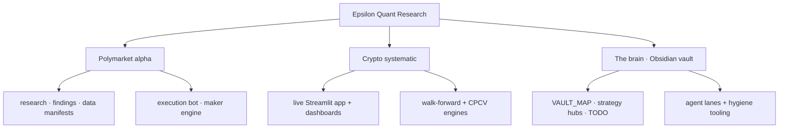

<h1 align="center">Epsilon — Quant Research</h1>

<p align="center">
  A quantitative research monorepo spanning <b>prediction-market microstructure</b> and <b>systematic crypto trading</b>,<br/>
  built on a self-documenting research knowledge base.
</p>

<p align="center">
  
  
  
  
  
</p>

---

## What's inside

Two independent research programs in one repo — separate environments, no shared code — plus a shared knowledge layer that ties them together.

| Program | Domain |
|---|---|
| **Polymarket alpha** | Prediction-market microstructure: copy-trading, structural market-making, options-delta valuation, and order-flow research |
| **Crypto systematic** | Binance trading: momentum, statistical arbitrage, and breakout strategies behind a live dashboard |
| **The brain** | An Obsidian knowledge base — maps, strategy hubs, and findings notes — that keeps the research navigable as it grows |

<p align="center">
  
</p>

## At a glance



## Layout

```
epsilon-quant-research/
├── brain/            # Obsidian knowledge base: maps, hubs, task list, agent lanes
├── polymarket/       # Prediction-market research + execution
├── live_trading/     # Unified Streamlit live-trading app
├── topics/           # Crypto strategy research (momentum, stat-arb, breakout, CPCV)
├── infrastructure/   # Walk-forward + CPCV engines
├── docs/             # Strategy & data references
└── tools/            # Repo-level tooling
```

## How we work

Every idea is written up, validated against a fixed battery of checks — out-of-sample splits, non-overlap math, confidence intervals, and capacity-aware realism — and **documented whether it succeeds or fails**, so the research compounds instead of repeating itself. The `brain/` is an [Obsidian](https://obsidian.md) vault that treats notes as a navigable wiki and maintains its own hygiene with a scanner in `tools/`.

## Tech

`Python 3.10+` · `DuckDB` over append-only `Parquet` · `uv` · `Streamlit` · Combinatorial Purged Cross-Validation · Obsidian (git-versioned)

---

<sub>This is the front door. Live parameters, capacity, and deployable edges live in private notes and are not published here — by design. What's shown is the approach.</sub>
