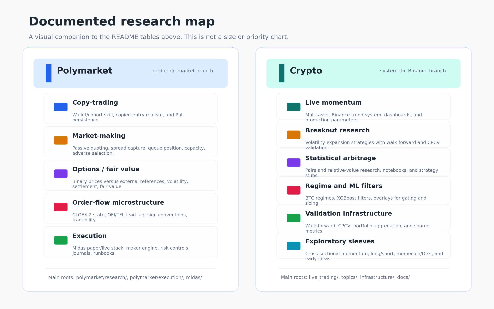
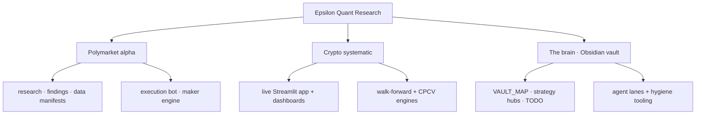

<h1 align="center">Epsilon — Quant Research</h1>

<p align="center">
  A quantitative research monorepo spanning <b>prediction-market microstructure</b> and <b>systematic crypto trading</b>,<br/>
  built on a self-documenting research knowledge base.
</p>

<p align="center">
  
  
  
  
  
</p>

---

## What's inside

This repo has **two main research branches** plus a shared knowledge layer:

1. **Polymarket** — prediction-market research and execution: copy-trading, market-making, binary-option/fair-value work, order-book microstructure, and the Midas execution stack.
2. **Crypto** — systematic Binance research and live trading: momentum, breakout, stat-arb, ML/regime filters, walk-forward validation, CPCV, and live dashboards.

The two branches share a repo, but not a runtime. They use separate environments, separate dependencies, and separate project boundaries. The `brain/` layer is the map that keeps both research programs navigable.

| Branch | What it owns | Main roots |
|---|---|
| **Polymarket** | Historical fill research, trader/wallet analysis, strategy notes, live/paper execution, maker engine, CLOB/LOB capture, data manifests | `polymarket/research/`, `polymarket/execution/`, `midas/` |
| **Crypto** | Binance strategy research, walk-forward/CPCV engines, live Streamlit dashboards, portfolio notebooks, regime/ML/stat-arb experiments | `live_trading/`, `topics/`, `infrastructure/`, `docs/` |
| **Brain** | Obsidian vault with maps, strategy hubs, TODOs, handoffs, agent lanes, and hygiene tooling | `brain/`, `tools/` |

## Documented research

The notes are organized by strategy cluster, but the names only make sense once you know what each cluster is trying to prove or disprove:

| Cluster | Plain-English purpose | Current shape |
|---|---|---|
| **Polymarket copy-trading** | Find cohorts of skilled wallets or trader styles worth following, then validate whether their edge survives historical reconstruction and execution realism. | Trader panels, cohort screens, relayer/identity audits, profile notes, and future execution handoff into Midas. |
| **Polymarket market-making** | Test whether passive liquidity provision can earn spread, rebate, or carry-to-resolution after adverse selection, queue position, capacity, and incumbent-maker concentration. | Historical maker-wallet studies, K5/K5-STRESS capacity work, politics NegRisk accounting, live measurement design, and maker-engine runbooks. |
| **Polymarket options-delta / fair value** | Compare Polymarket binary prices to external references such as underlying price, volatility, settlement source, and digital-option style fair values. | Mostly closed as a standalone pricing strategy; the surviving pieces are used as sizing, filtering, or execution diagnostics for market-making. |
| **Polymarket order-flow / Dali lineage** | Study CLOB/L2 microstructure: OFI, TFI, lead-lag, book state, sign conventions, and whether short-horizon order-flow signals are tradable. | A documented lineage of tests, many falsified, that feeds better data semantics and execution caution into the other Polymarket clusters. |
| **Crypto live momentum** | Trade a multi-asset Binance momentum universe with a live dashboard and production parameter set. | Active live stack around the 6-asset universe, with walk-forward optimization and dashboard wiring. |
| **Crypto validation engine** | Make strategy research harder to fool: rolling walk-forward, CPCV, portfolio aggregation, and shared backtest metrics. | Reusable infrastructure used by momentum, BB breakout, cross-sectional momentum, regime filters, and related crypto experiments. |
| **Crypto exploratory sleeves** | Explore adjacent ideas before they earn live status: BB breakout, stat-arb/pairs, ML prediction, BTC regime classification, long/short, memecoin/DeFi. | Topic folders and notebooks, with mature branches promoted into the validation stack when they deserve it. |

<p align="center">
  
</p>

## At a glance



## Layout

```
epsilon-quant-research/
├── brain/            # Obsidian knowledge base: maps, hubs, task list, agent lanes
├── polymarket/       # Prediction-market research + execution
├── live_trading/     # Unified Streamlit live-trading app
├── topics/           # Crypto strategy research (momentum, stat-arb, breakout, CPCV)
├── infrastructure/   # Walk-forward + CPCV engines
├── docs/             # Strategy & data references
└── tools/            # Repo-level tooling
```

## How we work

The research process is deliberately written down. A strategy should leave behind a trail that explains what was tested, what failed, what survived, and what would have to be true before the next build step.

The usual loop is:

1. **Frame the hypothesis.** What edge is supposed to exist, who is on the other side, and what would falsify it cheaply?
2. **Build the smallest useful test.** Prefer data audits, simple baselines, and power checks before adding infrastructure.
3. **Validate out of sample.** Use walk-forward splits, CPCV where appropriate, non-overlapping events, market-cluster confidence intervals, and explicit train/test boundaries.
4. **Add realism early.** Fees, spread, queue position, capacity, top-maker concentration, settlement mechanics, live data availability, and capital lockup are part of the research, not a final decoration.
5. **Document both sides.** Failed branches stay in the knowledge base so agents and humans do not rediscover dead ideas. Surviving branches get linked to the relevant hub, TODO, and runbook.
6. **Promote only after measurement.** A promising historical result becomes a live measurement loop before it becomes a production strategy.

The `brain/` folder is an [Obsidian](https://obsidian.md) vault for this process. It contains start-here maps, strategy hubs, handoffs, TODOs, and agent lanes. A scanner in `tools/` checks broken links, duplicate note names, missing summaries, and other graph hygiene so the knowledge base remains usable as the repo grows.

## Tech

`Python 3.10+` · `DuckDB` over append-only `Parquet` · `uv` · `Streamlit` · Combinatorial Purged Cross-Validation · Obsidian (git-versioned)

---

<sub>This is the front door. Live parameters, capacity, and deployable edges live in private notes and are not published here — by design. What's shown is the approach.</sub>
