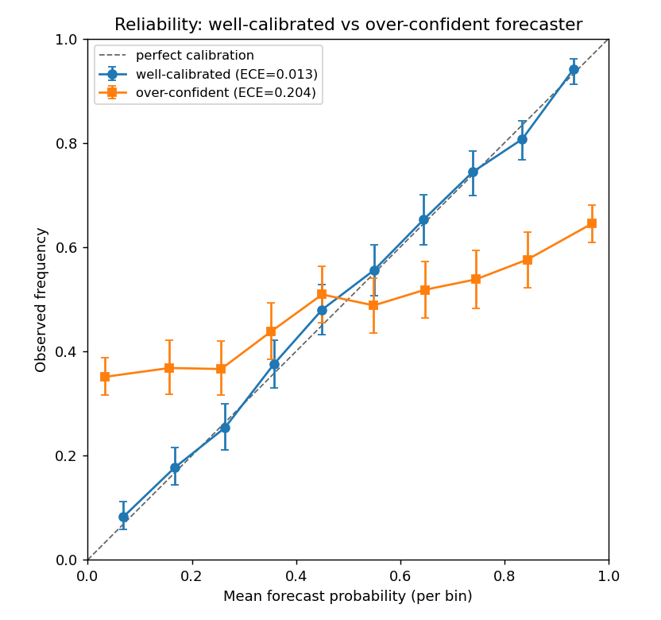

# Calibration Scoring Layer — are our probabilities any good? (the `calibrate` skill)

Hubs: `docs/STRATEGY_REFERENCE.md` · [[SKILL_MAP]] · [[CODEX]] · built on [[2026-06-29_superforecasting_skill_vendored]]

## Plain-English Summary

- **What this is.** A project-agnostic **calibration scoring layer** packaged as the prompt-invoked skill `calibrate`. It answers one question — *are these probabilities any good?* — with proper scores and diagnostics, not an opinion. It sits on top of the forked superforecasting ledger as a **read-only consumer** (it never writes the ledger or touches its state machine).
- **Why it was written.** We now log dated, resolvable, Brier-scored forecasts ([[2026-06-29_superforecasting_skill_vendored]]). That gives us the raw material to *measure calibration over time* — reliability, discrimination, over/under-confidence — and to recalibrate model probabilities and compare them to market-implied prices. This is the scoring half.
- **What it covers.** Brier + Murphy decomposition, log-loss, ECE/MCE, reliability diagrams with Wilson bands, Spiegelhalter's Z, calibration-in-the-large, isotonic/Platt recalibration, and a model-vs-market edge layer. The engine is duplicated **byte-identical** into each project (`infrastructure/calibration/` crypto, `polymarket/research/lib/calibration/` polymarket) and never cross-imported — the two books share no code or state.
- **Status / takeaway.** Built and gate-checked: the Brier–Murphy decomposition reconciles exactly on synthetic data; the reliability diagram cleanly separates a well- vs a deliberately over-confident forecaster; the calibration table reproduces `ml_metrics.calibration_table` byte-for-byte (no regression); and the forked ledger still rejects post-hoc mutation. **This is tooling, not a strategy** — it makes no edge claim.

## What the layer is (design)

The layer is pure scoring/diagnostics. It reuses the crypto research stack's conventions rather than re-deriving them:

- **`calibration_table(prob, label, n_bins)`** is a byte-for-byte reproduction of [`infrastructure/backtester/ml_metrics.py`](../infrastructure/backtester/ml_metrics.py)`:calibration_table` — same equal-width `pd.cut` binning, same `prob_bucket / mean_pred_prob / actual_freq / n` columns. Research code can swap one for the other with no behavior change.
- **Recalibration** mirrors [`infrastructure/ml/walk_forward.py`](../infrastructure/ml/walk_forward.py)'s `IsotonicRegression(out_of_bounds='clip')` fit-on-held-out pattern, with a pure-numpy PAV / IRLS fallback so it still runs where sklearn is absent (the polymarket venv has neither sklearn nor scipy).

Every gate-critical path uses only numpy + pandas + stdlib (`math.erf` for the normal CDF, so no scipy); matplotlib is imported lazily for plots only.

### Metric glossary (what each number means)

| Metric | Plain meaning | Good direction |
|---|---|---|
| **Brier score** | mean squared error of the forecasts, `mean((p − outcome)²)` | lower |
| **Reliability (REL)** | how far each bucket's forecast sits from that bucket's observed frequency — pure calibration error | lower (0 = perfectly calibrated) |
| **Resolution (RES)** | how much the buckets separate from the base rate — discrimination | higher |
| **Uncertainty (UNC)** | irreducible variance of the outcome, `base_rate·(1−base_rate)` | fixed by the data |
| **log-loss** | binary cross-entropy; punishes confident-and-wrong harder than Brier | lower |
| **ECE / MCE** | average / worst calibration gap across bins | lower |
| **Spiegelhalter's Z** | hypothesis test of calibration-in-the-large; `\|Z\|>1.96` ⇒ reject calibration at p<0.05 | near 0 |
| **calibration-in-the-large** | mean forecast vs base rate; `bias = mean_pred − base_rate` (>0 = systematic over-forecasting) | near 0 |

The headline identity is the **Murphy decomposition**: `Brier = Reliability − Resolution + Uncertainty`. Grouping by *unique forecast value* makes this hold **exactly**; binned (for a readable diagram) it can pick up a small within-bin-variance term, which the function returns honestly as `residual` rather than hiding (so `Brier = REL − RES + UNC + residual` is always true).

### Practical example (one forecast through the layer)

Say a model says "70% chance BTC closes up today" and it does (outcome = 1). That single forecast contributes `(0.70 − 1)² = 0.09` to the Brier score. Bucket it with other ~0.7 forecasts: if 7 of 10 such forecasts resolved YES, the 0.7 bucket is well-calibrated (observed 0.70 ≈ forecast 0.70) and adds ~0 to reliability. If only 4 of 10 resolved YES, that bucket is **over-confident** — it contributes `0.7·(0.70 − 0.40)² ` to reliability and bows below the diagonal on the diagram. The layer reads that off the ledger automatically once the forecasts are settled.

## Gate results (DoD)

All four pre-registered gates pass. Run the suite with:

```bash
PYTHONPATH=. uv run --no-project python -m infrastructure.calibration.tests.test_calibration   # crypto: 7 passed
cd polymarket/research && PYTHONPATH=. uv run python -m lib.calibration.tests.test_calibration  # pm: 6 passed, 1 skipped
```

| Gate | What it checks | Result |
|---|---|---|
| 1. Brier decomposition reconciles | `Brier == REL − RES + UNC` exactly (unique-value grouping) on synthetic data; binned form reconciles via `residual` | PASS — exact identity to < 1e-12 |
| 2. Reliability separates well vs over-confident | a deliberately over-confident forecaster has higher ECE and higher reliability term than a calibrated one | PASS — ECE 0.204 vs 0.013; REL 0.052 vs 0.000 (diagram below) |
| 3. Reproduces `ml_metrics.calibration_table` | identical table on a shared input (no regression) | PASS — `assert_frame_equal` on the crypto path |
| 4. Forked ledger rejects post-hoc mutation | re-run superforecasting's state-machine negative test on a genuinely SCORED forecast | PASS — `sf update` on a SCORED id → "illegal transition", exit 1 |

The polymarket run **skips gate 3** because `infrastructure.backtester.ml_metrics` is (correctly) not importable from the polymarket project — that skip is itself evidence the two books don't cross-import. Its recalibration gate passes on the **pure-numpy** path (no sklearn in that venv).

### End-to-end smoke (the layer consuming a real ledger)

Built 12 forecasts via `sf.py` into an isolated ledger, then ran `calibrate`:

```
n scored forecasts : 12
Brier              : 0.1381
  reliability      : 0.0628   resolution : 0.1667   uncertainty : 0.2500 (base 0.500)
  REL-RES+UNC      : 0.1461   (+ residual -8.0e-03  ← within-bin variance, reported not hidden)
log-loss           : 0.4382   ECE/MCE : 0.2208 / 0.5000
Spiegelhalter Z    : -0.998   (p=0.318; not rejected)
calibration-in-large: mean_pred 0.521 vs base 0.500 (bias +0.021)
```

A line-count check confirmed `events.jsonl` was **unchanged** before/after scoring — the layer is read-only on the ledger, as designed.

## Reliability diagram — the gate-2 picture



**How to read it.** X-axis = the mean probability the forecaster *said*, per bin; Y-axis = how often the event *actually* happened in that bin; the dashed 45° line is perfect calibration. Error bars are Wilson 95% bands on the observed frequency. Two synthetic forecasters over 4,000 forecasts each:

- **Well-calibrated (blue):** dots sit on the diagonal, ECE = 0.013 — when it says 0.8, things happen ~80% of the time.
- **Over-confident (orange):** the classic flattened-S — when it says 0.9 the event only happens ~65% of the time (dots **below** the diagonal at high p), and when it says 0.05 it still happens ~35% of the time (**above** the diagonal at low p). ECE = 0.204. This is exactly the failure mode the layer exists to catch.

**Realism read (per [[CODEX]] § Realism calibration).** Read the *bands*, not just the dots. An off-diagonal point whose Wilson band still straddles the diagonal is **not yet** evidence of miscalibration — it can be small-sample noise. The bands are wide where a bin has few forecasts; that is the honest signal to collect more before declaring a forecaster mis-calibrated. The layer therefore never reports a calibration verdict from point estimates alone.

## How to run it (per project — NEVER cross-import)

```bash
# crypto (from repo root; repo .venv)
PYTHONPATH=. uv run --no-project python -m infrastructure.calibration.cli --book crypto score
PYTHONPATH=. uv run --no-project python -m infrastructure.calibration.cli --book crypto report --out docs/assets/crypto_calibration.png

# polymarket (from polymarket/research/)
cd polymarket/research
PYTHONPATH=. uv run python -m lib.calibration.cli --book polymarket score
```

The `--book` (or `$SF_BOOK` / `$SF_LEDGER_DIR`) selects which forked ledger to read. With neither set the layer refuses to guess — the two books share no state.

## Decision and next step

**Decision: built and verified; adopt as standing tooling.** This is the scoring counterpart to the superforecasting ledger — together they make a closed loop: log a dated forecast → settle it → score calibration over the accumulated history → recalibrate or adjust. It is deliberately **not** a strategy and carries no edge claim; the markets layer (`model_p` vs de-vigged `implied_p`, realized edge over resolved markets) is wired and unit-tested but only becomes meaningful once real resolved markets accumulate in a book's ledger.

**Next step (when there is data, not now):** once a book has a non-trivial number of SCORED forecasts, run `calibrate ... report` to produce that book's first real reliability diagram and Spiegelhalter Z, and — if a model is being priced against a market — use the markets layer to track realized edge. Until then this note records the tool, its gates, and the synthetic validation only. Do not interpret the synthetic numbers above as any statement about a live model.
