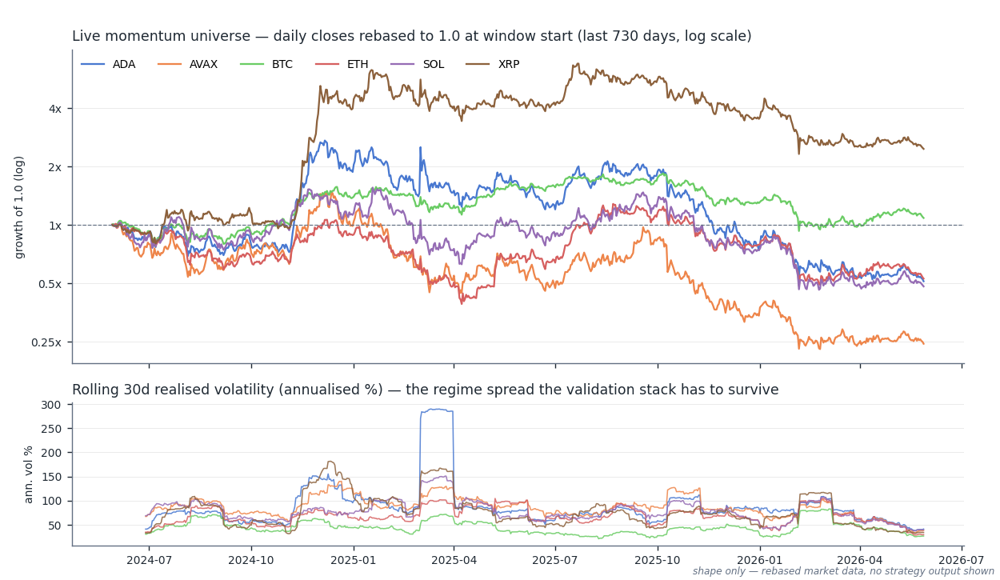

# Live Trading — Unified Streamlit App

One Streamlit app runs every live crypto strategy in the repo. A fund landing page summarises all strategies; three shared pages (live dashboards, trade journal, portfolio analytics) render each strategy through the same components; and each strategy lives in its own self-contained dashboard directory. The momentum book trades a six-asset Binance universe (ADA, AVAX, BTC, ETH, SOL, XRP); BB breakout and stat-arb dashboards are built and wired through the same machinery.

## Why this is disciplined, not just a dashboard

- **Parameters only ever come from the optimiser.** Each dashboard reads `live_params.json`, written exclusively by that strategy's walk-forward `optimise.py`. There are no hand-set parameters; a dashboard renders no signals until the optimiser has run for at least one asset.
- **Strategies graduate here, they don't start here.** A strategy reaches a dashboard only after walk-forward validation, Combinatorial Purged Cross-Validation, and the pre-registered overfitting gate (Deflated Sharpe Ratio, PBO, White's Reality Check) — see [the validation engines](../infrastructure/README.md) and the [momentum CPCV workflow](../topics/momentum/strategies/momentum_cpcv/README.md).
- **The journal is append-only.** Every entry and exit appends a record to `trades.json` with both the theoretical execution price and the actual fill, so slippage is measured per trade instead of assumed. Capital and size are frozen into the entry record at trade time — historical records never get recomputed under a new config.
- **State is never trusted stale.** Open positions (`positions.json`) are re-read uncached on every render cycle; stop ratchets use a two-state pending/confirmed flow; per-position MAE is computed from exchange OHLC and cached.

## The trading universe



*Top: daily closes of the six live momentum assets, rebased to 1.0 at the window start (log scale) — dispersion across the universe is the point of running a multi-asset book. Bottom: rolling 30-day realised volatility (annualised %) — the regime spread the validation stack has to survive. Rebased market data only; no strategy output is shown.*

## Layout

```
live_trading/
├── app.py                  ← fund landing page (summary across all strategies)
├── pages/
│   ├── 1_Dashboards.py     ← live signals + trade entry/exit forms, one tab per strategy
│   ├── 2_Trade_Log.py      ← trade journal views
│   └── 3_Portfolio.py      ← equity / drawdown / deployment analytics
├── shared/                 ← single source of truth for reusable logic
│   ├── data_loader.py      ← all file I/O: trades, positions, params, equity curves
│   ├── cache_manager.py    ← incremental OHLCV parquet cache (daily + hourly)
│   ├── charts.py           ← Plotly chart builders
│   └── …                   ← styles, trade-log / portfolio components, websocket manager
├── dashboards/
│   ├── momentum/           ← live reference implementation (6-asset trend book)
│   ├── bbbreakout/         ← Bollinger-breakout dashboard (built, journal empty so far)
│   └── statarb/            ← stat-arb dashboard (built, journal empty so far)
├── update_cache.py         ← incremental cache refresh (auto-run by the app)
└── backfill_cache.py       ← one-time historical cache backfill
```

Every dashboard directory exports the same contract — `config.py`, `strategies.py`, `dashboard.py` (computation, no Streamlit), `optimise.py`, `streamlit_app.py`, plus its own `trades.json` / `positions.json` / `live_params.json` — so `shared/` components serve all strategies unmodified.

## How data flows

```
Binance API → shared/cache_manager.py → cache/{daily,hourly}/*.parquet   (git-ignored)
            → dashboards/<s>/dashboard.py → streamlit_app.py             (signals + forms)
            → trades.json (append-only) + positions.json (read fresh)
            → shared/data_loader.py → Trade Log / Portfolio pages
```

## Run it

```bash
pip install -r live_trading/requirements.txt

# one-time cache backfill, then the app keeps it fresh automatically
python3 live_trading/backfill_cache.py

# the unified app (all strategies, all pages)
streamlit run live_trading/app.py

# optimise an asset before adding it to a strategy's ACTIVE_ASSETS
python3 live_trading/dashboards/momentum/optimise.py --asset ETHUSDT
```

Full architecture reference — schemas, component contracts, and the add-a-strategy walkthrough — lives in [CLAUDE.md](CLAUDE.md).
