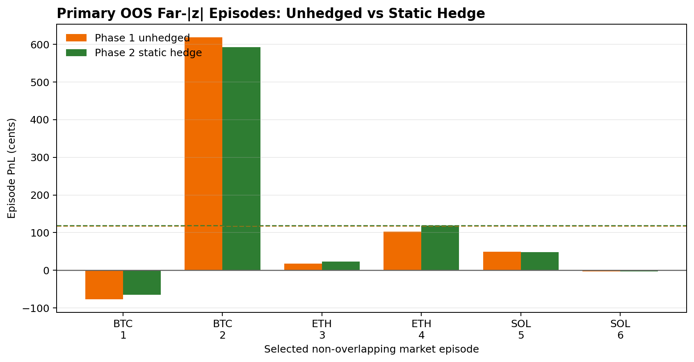
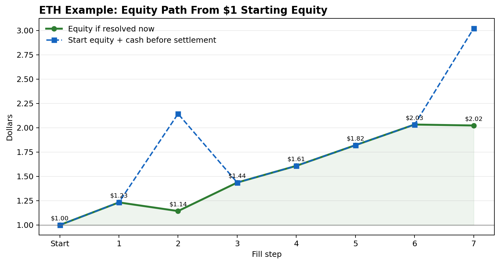
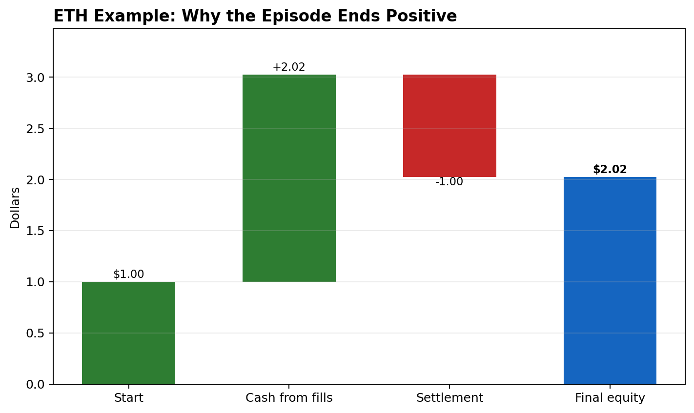

# OD Strategy A v2 Lifecycle

> Hub: [[strat_options_delta]] · [[POLYMARKET_BRAIN]]
> Table terms: [[polymarket_table_dictionary]]

## Headline

Gate 1 fails: unhedged K5 winner lifecycle does not clear OOS lower-CI on this replay.

Primary OOS far-|z| family (`all` source): n=6 markets, 68 fills, mean 118.08c, CI [-17.14c, 323.46c].

Strict-source OOS far-|z| diagnostic: n=6, mean 115.78c, CI [4.13c, 319.24c].

Phase 1 missed the lower-CI>0 gate by 17.14c.

Phase 2 hedge overlay was run anyway per steer, but it remains labeled diagnostic because the unhedged lifecycle is still the edge gate.

Best primary Phase 2 overlay: `static_fraction` h=1.00, B=static, mean 119.20c, CI [-10.56c, 313.41c], variance reduction 9.76%, premium retained 1.01.

## How to Read This Note

This is an Options-Delta Strategy A replay, not a Block K taker race. The edge being tested is the K5-style maker lifecycle: passive K-PEG fills, two-sided inventory when both UP and DOWN fills arrive in the same market, no Polymarket exit, and settlement at resolution. The Binance hedge in Phase 2 is only a variance overlay on that lifecycle; it is not allowed to create the edge by itself.

Unit of analysis is a **market episode**. Within a market episode, all eligible fills are aggregated into one inventory path. The global time embargo then keeps only non-overlapping market windows for each restricted bucket strategy so capital is not counted twice across overlapping 4h contracts.

Samples:

- `is_discovery` is in-sample and shown only as context.
- `oos_holdout` is the decision sample.
- `all` source means the normal K5/K-PEG replay universe.
- `strict` source additionally requires the Chainlink/Binance settlement-source filters; it is a diagnostic because it changes the universe.

Decision gate: OOS `far_absz_ge1_all_tau`, source `all`, global market-episode embargo, lower 95% CI > 0. Phase 1 missed that gate by 17.14c, so the official lifecycle verdict remains fail even though the mean is strongly positive.

## Bucket Glossary

Reusable OD bucket definitions live in [[polymarket_table_dictionary#OD Strategy A Bucket Labels]].

Moneyness buckets use `abs_z = abs(log(S/K) / (sigma * sqrt(tau)))`, where `S` is Binance spot, `K` is the window-open strike, `sigma` is causal EWMA/trailing vol from the K6 surface, and `tau` is time to expiry.

- `near_absz_lt0.25`: close to the strike; high binary jump risk.
- `mid_absz_0.25_1`: moderate distance from strike; delta is usually meaningful.
- `far_absz_ge1`: far from strike; longshot/pinned regime.
- `late_lt30m`: less than 30 minutes to expiry.
- `mid_30m_2h`: 30 minutes to 2 hours to expiry.
- `early_gt2h`: more than 2 hours to expiry.
- `far_absz_ge1|late_lt30m` means the intersection of far moneyness and late time. `far_absz_ge1_all_tau` pools far moneyness across all time buckets.

## Table Column Glossary

Shared table definitions live in [[polymarket_table_dictionary]]. The local glossary below defines v2-specific columns.

All PnL columns are per market episode and displayed in cents. All CIs are 95% bootstrap confidence intervals over market episodes.

Phase 1 columns:

- `markets`: number of non-overlapping market episodes.
- `fills`: total K-PEG fills inside those selected episodes.
- `mean net`: settlement PnL plus maker rebate, with no Polymarket exit and no hedge.
- `CI`: bootstrap CI for `mean net`.
- `win`: share of selected market episodes with positive net PnL.
- `PnL std`: standard deviation of episode net PnL.
- `settlement std`: standard deviation of the binary settlement leg; this is the jump variance a hedge is trying to tame.
- `two-sided`: share of episodes containing both UP and DOWN token fills.
- `carry`: residual inventory carried to resolution divided by gross filled inventory.
- `median hold min`: median time from episode median fill to resolution.

Phase 2 columns:

- `policy`: hedge-ratio rule.
- `h`: base hedge ratio.
- `B`: rebalance band in Binance notional; `static` means set the first nonzero hedge and do not rebalance until settlement.
- `net`: Phase 1 episode PnL plus Binance hedge PnL minus Binance costs.
- `win`: share of selected market episodes with positive hedged net PnL.
- `hedge cost`: average Binance cost at 6 bp per hedge trade/settlement notional.
- `prem retained`: hedged mean net divided by unhedged Phase 1 mean net. This can be unstable or negative when the unhedged mean is near zero or negative.
- `var reduced`: `1 - hedged variance / unhedged variance`; negative means the hedge increased variance.
- `rebal`: average count of intrawindow hedge rebalances, excluding final settlement flatten.

## Practical Money Example

The table means are **dollars per selected market episode**, displayed as cents. They are not percentage returns and not per-fill averages. One selected OOS primary-gate episode is `eth-updown-4h-1780113600`, with 7 eligible K-PEG fills in the `far_absz_ge1_all_tau` bucket.

Position convention:

- `token_position = +1`: we are long one Polymarket token.
- `token_position = -1`: we are short one Polymarket token.
- `payoff = 1` if that token resolves correctly, else `0`.
- maker rebate per fill is `0.20 * 0.07 * p * (1 - p)`.

Phase 1 Polymarket-only PnL per fill:

```text
long token:  payoff - entry_price + rebate
short token: entry_price - payoff + rebate
```

Actual fills in that ETH episode:

```text
short UP   at 0.23, UP lost   -> 0.23 - 0 + rebate = +0.2325
short DOWN at 0.91, DOWN won  -> 0.91 - 1 + rebate = -0.0889
long DOWN  at 0.71, DOWN won  -> 1 - 0.71 + rebate = +0.2929
short UP   at 0.17, UP lost   -> 0.17 - 0 + rebate = +0.1720
short UP   at 0.21, UP lost   -> 0.21 - 0 + rebate = +0.2123
short UP   at 0.21, UP lost   -> 0.21 - 0 + rebate = +0.2123
short DOWN at 0.99, DOWN won  -> 0.99 - 1 + rebate = -0.0099
```

Episode totals:

```text
Polymarket cash/rebate leg = +$2.0233
binary settlement leg      = -$1.0000
Phase 1 net                = +$1.0233 = +102.33c
gross filled contracts     = 7
rough PnL per gross fill   = +$1.0233 / 7 = +14.62c
```

That `+102.33c` is one of the 6 primary OOS far-|z| market episodes. The Phase 1 headline mean is the simple episode average:

```text
episodes: [-76.63c, +618.73c, +48.98c, +17.81c, -2.76c, +102.33c]
mean     = +118.08c
win      = 4 / 6 = 66.67%
```



Phase 2 adds a Binance hedge. This is not another Polymarket bet; it is a spot/perp position in the underlying coin. The hedge target is:

```text
signed_delta = net_UP_inventory * digital_delta - net_DOWN_inventory * digital_delta
binance_units = -h * signed_delta
```

So long UP or short DOWN has positive coin delta and gets hedged by shorting Binance. Short UP or long DOWN has negative coin delta and gets hedged by going long Binance.

For the best primary Phase 2 row (`static_fraction`, `h=1.00`, `B=static`), the first nonzero hedge in the ETH example is set after the first fill:

```text
first fill: short 1 UP
ETH spot: $2006.40
digital delta: 0.02295993
signed delta: -0.02295993
Binance hedge: +0.02295993 ETH long
ETH close: $2016.32

hedge PnL = 0.02295993 * (2016.32 - 2006.40)
          = +$0.2278
```

Binance costs are 6 bp on hedge entry/settlement turnover:

```text
entry notional ~= 0.02295993 * 2006.40 = $46.06
exit notional  ~= 0.02295993 * 2016.32 = $46.30
turnover       ~= $92.36
hedge cost     = 92.36 * 0.0006 = $0.0554
```

So the Phase 2 net for the same episode is:

```text
Phase 1 net   = +$1.0233
hedge PnL     = +$0.2278
hedge cost    = -$0.0554
Phase 2 net   = +$1.1956 = +119.56c
```

The Phase 2 headline mean uses the same 6-episode average:

```text
mean unhedged Phase 1 = +$1.1808
mean hedge PnL        = +$0.0519
mean hedge cost       = -$0.0407
mean Phase 2 net      = +$1.1920 = +119.20c
```

The hedge therefore barely changes the mean. Its purpose is variance reduction:

```text
Phase 1 std = 252.28c
Phase 2 std = 239.65c
variance reduction = 9.76%
```

That is why the primary CI improves from `[-17.14c, 323.46c]` to `[-10.56c, 313.41c]`, but still does not clear zero.

### Exposure Path From $1 Starting Equity

The replay is **not** "post one bid on UP and one bid on DOWN, then cancel the other after the first fill." Phase 1 intentionally takes every eligible K-PEG maker fill within the selected market episode. That is the K5 lifecycle being reproduced: inventory can become two-sided, matched legs can cancel exposure, and remaining inventory is carried to resolution.

Also, `short UP` / `short DOWN` is economic notation. On Polymarket this must be collateralized through existing inventory or complete-set mechanics; it is not an uncollateralized naked short. Economically, `short DOWN at 0.91` is the same payoff as `long UP at 0.09`, but it is recorded as `short DOWN` because the actual maker fill happened on the DOWN token book.

For the same ETH episode, assume we start with `$1.00` of equity and track cash plus final settlement value. In this market DOWN won, so each UP token settles to `$0` and each DOWN token settles to `$1`.

Column meanings:

- `cash change`: immediate cash from this fill, including rebate. Shorts add cash; longs spend cash.
- `cash after fills`: cumulative cash collected/spent so far, before final token settlement.
- `UP inv` / `DOWN inv`: remaining inventory in contract units. Positive means long, negative means short.
- `settlement value if resolved now`: value or liability of current inventory using this example's final outcome. Since DOWN won, UP inventory is worth `$0`, and each short DOWN is a `$1` liability.
- `equity if resolved now`: `starting equity + cash after fills + settlement value`. This is a hindsight settlement-value path for explanation, not a live mark-to-market or margin calculation.





| step | trade | cash change | cash after fills | UP inv | DOWN inv | settlement value if resolved now | equity if resolved now |
| --- | --- | --- | --- | --- | --- | --- | --- |
| 1 | short UP @ 0.23 | +$0.2325 | +$0.2325 | -1 | 0 | $0.0000 | $1.2325 |
| 2 | short DOWN @ 0.91 | +$0.9111 | +$1.1436 | -1 | -1 | -$1.0000 | $1.1436 |
| 3 | long DOWN @ 0.71 | -$0.7071 | +$0.4365 | -1 | 0 | $0.0000 | $1.4365 |
| 4 | short UP @ 0.17 | +$0.1720 | +$0.6085 | -2 | 0 | $0.0000 | $1.6085 |
| 5 | short UP @ 0.21 | +$0.2123 | +$0.8208 | -3 | 0 | $0.0000 | $1.8208 |
| 6 | short UP @ 0.21 | +$0.2123 | +$1.0331 | -4 | 0 | $0.0000 | $2.0331 |
| 7 | short DOWN @ 0.99 | +$0.9901 | +$2.0233 | -4 | -1 | -$1.0000 | $2.0233 |

Final accounting:

```text
starting equity = $1.0000
final equity    = $2.0233
net PnL         = $1.0233 = +102.33c
```

The key exposure after the final fill is `short 4 UP` and `short 1 DOWN`. Because DOWN won, the short UP inventory expired worthless in our favor, while the short DOWN inventory cost `$1` at settlement. The episode still made money because it collected `$2.0233` of net cash/rebate before paying that `$1` settlement.

## Phase 0 — Token Side Correctness

Actual outcome side is now derived from the K-PEG fill `asset_id` joined to the stored `outcome_index` in `block_a1_features.parquet` (`0=up`, `1=down`). The old heuristic inferred side by whichever K6 UP/DOWN mid was closer to the asset mid.

- fills checked: `370`
- missing actual outcome map: `0`
- old-heuristic mismatches: `5` (1.35%)
- eligible fills after two-sided/spike filters: `362`
- strict-source eligible fills: `241`

Read: the old heuristic was mostly right but not exact. The nonzero mismatch rate means payoff and delta sign should use the actual token map going forward.

## Phase 1 — OOS Lifecycle Buckets

Primary source scope is all source-validity rows, matching the K5 real-maker lifecycle reproduction. Strict-source rows are reported as a settlement-basis diagnostic. Episodes are market-level, multi-fill, carried to resolution, and globally time-embargoed so overlapping 4h windows are not double-counted within each restricted bucket strategy.

| bucket | markets | fills | mean net | CI | win | PnL std | settlement std | two-sided | carry | median hold min |
| --- | --- | --- | --- | --- | --- | --- | --- | --- | --- | --- |
| far_absz_ge1_all_tau | 6 | 68 | 118.08c | [-17.14c, 323.46c] | 66.67% | 252.28c | 1006.81c | 83.33% | 91.53% | 15.9 |
| far_absz_ge1\|late_lt30m | 6 | 80 | 104.94c | [-4.12c, 294.12c] | 33.33% | 227.93c | 636.92c | 66.67% | 93.37% | 6.8 |
| far_absz_ge1\|mid_30m_2h | 6 | 26 | 53.02c | [-3.36c, 139.07c] | 66.67% | 106.55c | 612.37c | 16.67% | 100.00% | 53.0 |
| far_absz_ge1\|early_gt2h | 3 | 5 | 66.72c | [-76.63c, 253.55c] | 66.67% | 169.33c | 57.74c | 0.00% | 100.00% | 149.8 |
| mid_absz_0.25_1\|early_gt2h | 2 | 7 | 41.84c | [-2.66c, 86.33c] | 50.00% | 62.93c | 141.42c | 50.00% | 50.00% | 187.4 |
| near_absz_lt0.25\|early_gt2h | 3 | 5 | -0.35c | [-17.42c, 19.67c] | 33.33% | 18.72c | 57.74c | 66.67% | 100.00% | 233.2 |
| mid_absz_0.25_1\|late_lt30m | 6 | 18 | 17.03c | [-45.93c, 64.51c] | 83.33% | 74.65c | 296.65c | 16.67% | 80.00% | 21.9 |
| near_absz_lt0.25_all_tau | 5 | 9 | -19.93c | [-71.19c, 19.68c] | 40.00% | 58.61c | 70.71c | 40.00% | 80.00% | 157.7 |
| near_absz_lt0.25\|late_lt30m | 1 | 4 | -74.63c | [-74.63c, -74.63c] | 0.00% | 0.00c | 0.00c | 100.00% | 50.00% | 23.6 |
| near_absz_lt0.25\|mid_30m_2h | 5 | 13 | 34.72c | [-94.11c, 204.82c] | 40.00% | 196.62c | 192.35c | 40.00% | 100.00% | 82.3 |
| mid_absz_0.25_1_all_tau | 6 | 22 | -35.67c | [-114.25c, 23.18c] | 33.33% | 100.33c | 197.48c | 33.33% | 77.27% | 77.2 |
| mid_absz_0.25_1\|mid_30m_2h | 5 | 17 | -88.06c | [-173.39c, -6.44c] | 20.00% | 107.59c | 164.32c | 20.00% | 84.00% | 68.6 |

## Strict-Source OOS Diagnostic

| bucket | markets | fills | mean net | CI | win | PnL std | settlement std | two-sided | carry | median hold min |
| --- | --- | --- | --- | --- | --- | --- | --- | --- | --- | --- |
| far_absz_ge1_all_tau | 6 | 84 | 115.78c | [4.13c, 319.24c] | 66.67% | 247.10c | 904.25c | 100.00% | 96.30% | 5.5 |
| far_absz_ge1\|late_lt30m | 6 | 59 | -2.71c | [-5.43c, -0.90c] | 0.00% | 3.23c | 504.98c | 33.33% | 100.00% | 5.5 |
| far_absz_ge1\|mid_30m_2h | 5 | 24 | 68.96c | [8.68c, 171.41c] | 80.00% | 110.84c | 670.82c | 20.00% | 100.00% | 54.7 |
| far_absz_ge1\|early_gt2h | 1 | 3 | 253.55c | [253.55c, 253.55c] | 100.00% | 0.00c | 0.00c | 0.00% | 100.00% | 147.9 |
| mid_absz_0.25_1\|late_lt30m | 3 | 4 | 33.12c | [20.22c, 50.02c] | 100.00% | 15.29c | 57.74c | 0.00% | 100.00% | 22.0 |
| mid_absz_0.25_1\|early_gt2h | 2 | 7 | 41.84c | [-2.66c, 86.33c] | 50.00% | 62.93c | 141.42c | 50.00% | 50.00% | 187.4 |
| near_absz_lt0.25\|early_gt2h | 3 | 5 | -0.35c | [-17.42c, 19.67c] | 33.33% | 18.72c | 57.74c | 66.67% | 100.00% | 233.2 |
| near_absz_lt0.25_all_tau | 5 | 9 | -19.93c | [-71.19c, 19.68c] | 40.00% | 58.61c | 70.71c | 40.00% | 80.00% | 157.7 |
| near_absz_lt0.25\|mid_30m_2h | 4 | 11 | 67.13c | [-75.49c, 265.70c] | 50.00% | 211.05c | 216.02c | 25.00% | 100.00% | 80.6 |
| mid_absz_0.25_1_all_tau | 6 | 22 | -35.67c | [-114.25c, 23.18c] | 33.33% | 100.33c | 197.48c | 33.33% | 77.27% | 77.2 |
| mid_absz_0.25_1\|mid_30m_2h | 4 | 12 | -94.21c | [-196.24c, 7.81c] | 25.00% | 123.22c | 182.57c | 25.00% | 90.00% | 71.4 |

## Phase 2 — Hedge Overlay Frontier

Diagnostic only: Phase 1 failed by 17.14c, but the CI was close enough to inspect the variance/cost frontier. Hedge rows use the same market-episode inventory path, Binance spot hedge at `6.0bp` per hedge trade/settlement notional, and no Polymarket exit. `B=static` means set the first nonzero hedge and never rebalance; finite B rebalances when target hedge notional drifts by at least that many dollars.

Primary all-source OOS far-|z| family:

| bucket | policy | h | B | markets | net | net CI | win | hedge cost | prem retained | var reduced | rebal |
| --- | --- | --- | --- | --- | --- | --- | --- | --- | --- | --- | --- |
| far_absz_ge1_all_tau | static_fraction | 1.00 | static | 6 | 119.20c | [-10.56c, 313.41c] | 66.67% | 4.06c | 1.01 | 9.76% | 0.0 |
| far_absz_ge1_all_tau | static_fraction | 0.75 | static | 6 | 118.92c | [-11.91c, 315.51c] | 66.67% | 3.05c | 1.01 | 7.39% | 0.0 |
| far_absz_ge1_all_tau | iv_rv_spread_dependent | 1.00 | static | 6 | 116.45c | [-11.98c, 311.37c] | 66.67% | 1.44c | 0.99 | 9.50% | 0.0 |
| far_absz_ge1_all_tau | iv_rv_spread_dependent | 0.75 | static | 6 | 116.66c | [-12.17c, 312.40c] | 66.67% | 1.29c | 0.99 | 8.77% | 0.0 |
| far_absz_ge1_all_tau | iv_rv_spread_dependent | 0.50 | static | 6 | 117.42c | [-13.50c, 315.83c] | 66.67% | 0.94c | 0.99 | 6.10% | 0.0 |
| far_absz_ge1_all_tau | static_fraction | 0.50 | static | 6 | 118.64c | [-13.83c, 317.69c] | 66.67% | 2.03c | 1.00 | 4.97% | 0.0 |
| far_absz_ge1_all_tau | z_dependent | 1.00 | static | 6 | 118.86c | [-14.54c, 319.45c] | 66.67% | 1.77c | 1.01 | 3.62% | 0.0 |
| far_absz_ge1_all_tau | z_dependent | 0.25 | $100 | 6 | 100.84c | [-14.86c, 273.05c] | 66.67% | 6.80c | 0.85 | 29.82% | 1.0 |
| far_absz_ge1_all_tau | z_dependent | 0.75 | static | 6 | 118.66c | [-15.19c, 320.46c] | 66.67% | 1.33c | 1.00 | 2.72% | 0.0 |
| far_absz_ge1_all_tau | iv_rv_spread_dependent | 0.25 | static | 6 | 117.75c | [-15.42c, 319.54c] | 66.67% | 0.47c | 1.00 | 3.08% | 0.0 |
| far_absz_ge1_all_tau | static_fraction | 0.25 | static | 6 | 118.36c | [-15.48c, 320.58c] | 66.67% | 1.02c | 1.00 | 2.51% | 0.0 |
| far_absz_ge1_all_tau | z_dependent | 0.50 | static | 6 | 118.47c | [-15.84c, 321.46c] | 66.67% | 0.88c | 1.00 | 1.82% | 0.0 |

Best all-source OOS overlays across buckets:

| bucket | policy | h | B | markets | net | net CI | win | hedge cost | prem retained | var reduced | rebal |
| --- | --- | --- | --- | --- | --- | --- | --- | --- | --- | --- | --- |
| mid_absz_0.25_1\|early_gt2h | vol_dependent | 1.00 | $25 | 2 | 22.14c | [1.25c, 43.03c] | 100.00% | 11.04c | 0.53 | 77.95% | 5.0 |
| mid_absz_0.25_1\|early_gt2h | static_fraction | 0.75 | $25 | 2 | 8.22c | [0.60c, 15.84c] | 100.00% | 15.65c | 0.20 | 97.07% | 8.0 |
| near_absz_lt0.25\|early_gt2h | z_dependent | 1.00 | $25 | 3 | 12.47c | [-0.69c, 35.16c] | 66.67% | 10.88c | -35.85 | -11.12% | 4.3 |
| far_absz_ge1\|late_lt30m | static_fraction | 1.00 | static | 6 | 96.92c | [-1.54c, 283.29c] | 50.00% | 11.79c | 0.92 | 1.69% | 0.0 |
| near_absz_lt0.25\|early_gt2h | static_fraction | 0.75 | $25 | 3 | 12.90c | [-1.67c, 31.72c] | 66.67% | 7.97c | -37.08 | 16.62% | 3.3 |
| far_absz_ge1\|late_lt30m | static_fraction | 0.75 | static | 6 | 98.92c | [-2.05c, 286.31c] | 50.00% | 8.84c | 0.94 | 1.43% | 0.0 |
| far_absz_ge1\|late_lt30m | z_dependent | 1.00 | static | 6 | 101.50c | [-2.66c, 289.38c] | 33.33% | 5.37c | 0.97 | 1.12% | 0.0 |
| far_absz_ge1\|late_lt30m | static_fraction | 0.50 | static | 6 | 100.93c | [-2.78c, 288.90c] | 33.33% | 5.90c | 0.96 | 1.06% | 0.0 |
| far_absz_ge1\|mid_30m_2h | vol_dependent | 0.50 | $250 | 6 | 49.16c | [-3.25c, 127.60c] | 66.67% | 1.27c | 0.93 | 16.35% | 0.0 |
| far_absz_ge1\|mid_30m_2h | vol_dependent | 0.50 | static | 6 | 49.16c | [-3.25c, 127.60c] | 66.67% | 1.27c | 0.93 | 16.35% | 0.0 |
| far_absz_ge1\|mid_30m_2h | vol_dependent | 0.25 | $100 | 6 | 51.09c | [-3.27c, 133.34c] | 66.67% | 0.63c | 0.96 | 8.37% | 0.0 |
| far_absz_ge1\|mid_30m_2h | vol_dependent | 0.25 | $250 | 6 | 51.09c | [-3.27c, 133.34c] | 66.67% | 0.63c | 0.96 | 8.37% | 0.0 |

Minimum hedge rows with lower-CI > 0, where any exist:

| bucket | policy | h | B | net | net CI | var reduced | prem retained |
| --- | --- | --- | --- | --- | --- | --- | --- |
| mid_absz_0.25_1\|early_gt2h | static_fraction | 0.75 | $25 | 8.22c | [0.60c, 15.84c] | 97.07% | 0.20 |

## IS Lead Table

Discovery rows are shown only as a lead.

| bucket | markets | fills | mean net | CI | win | PnL std | settlement std | two-sided | carry | median hold min |
| --- | --- | --- | --- | --- | --- | --- | --- | --- | --- | --- |
| far_absz_ge1_all_tau | 3 | 17 | -4.48c | [-12.05c, -0.39c] | 0.00% | 6.56c | 378.59c | 0.00% | 100.00% | 20.4 |
| far_absz_ge1\|late_lt30m | 3 | 16 | -0.53c | [-0.99c, -0.20c] | 0.00% | 0.41c | 416.33c | 0.00% | 100.00% | 20.4 |
| far_absz_ge1\|early_gt2h | 1 | 1 | -11.85c | [-11.85c, -11.85c] | 0.00% | 0.00c | 0.00c | 0.00% | 100.00% | 139.3 |
| mid_absz_0.25_1_all_tau | 1 | 3 | 48.63c | [48.63c, 48.63c] | 100.00% | 0.00c | 0.00c | 100.00% | 100.00% | 151.9 |
| mid_absz_0.25_1\|early_gt2h | 1 | 3 | 48.63c | [48.63c, 48.63c] | 100.00% | 0.00c | 0.00c | 100.00% | 100.00% | 151.9 |
| near_absz_lt0.25_all_tau | 1 | 1 | -42.66c | [-42.66c, -42.66c] | 0.00% | 0.00c | 0.00c | 0.00% | 100.00% | 161.4 |
| near_absz_lt0.25\|early_gt2h | 1 | 1 | -42.66c | [-42.66c, -42.66c] | 0.00% | 0.00c | 0.00c | 0.00% | 100.00% | 161.4 |

## Gate 1 Decision

Pre-registered decision gate: OOS `far_absz_ge1_all_tau`, global market-episode embargo, lower CI > 0.

Primary OOS far-|z| family (`all` source): n=6 markets, 68 fills, mean 118.08c, CI [-17.14c, 323.46c].

Decision: **FAIL**.

Phase 2 was run as requested despite the Phase 1 miss. Treat its frontier as a hedge-design diagnostic, not a rescue of the unhedged edge gate.

Outputs:

- `data/analysis/csv_outputs/options_delta/od_strategy_a_v2_lifecycle.csv`
- `data/analysis/od_strategy_a_v2_lifecycle_trades.parquet`
- `data/analysis/od_strategy_a_v2_lifecycle_fills.parquet`
