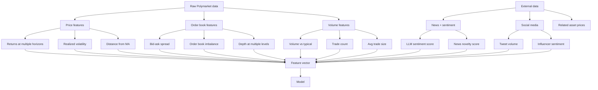
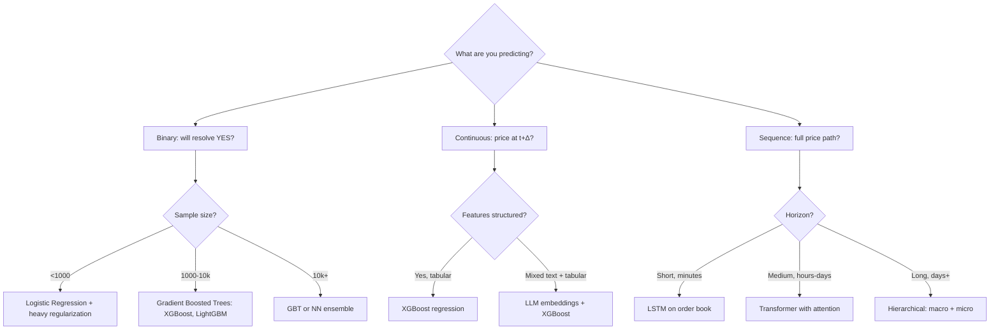

# Polymarket — Factor Construction & Model Architecture

> Hub: [[COWORK]]
> **Core thesis (revised).** The hold-to-resolution vs trade-the-price distinction depends on
> *where the edge lives*, not market characteristics. Hold-to-resolution when your edge is a
> better terminal probability estimate. Trade-the-price when your edge is information arrival
> speed. Use ML to denoise known structural factors (longshot bias, liquidity premium, time
> decay) rather than to invent patterns from scratch. **Most importantly: verify the market
> exists with real liquidity, identify your specific competition, and prove your supposed
> edge before building infrastructure.**
> Table terms: [[polymarket_table_dictionary]]

> **The forcing question.** "If the market price didn't move at all between now and resolution,
> would I still make money?" If yes → hold-to-resolution. If no → trade-the-price.

## Summary

This foundation note lays out the factor-construction and model architecture for Polymarket research. It reframes strategy choice around where the edge lives: terminal probability for hold-to-resolution, and price dynamics for trade-the-price. The note is an active reference for feature design, model selection, and market/liquidity verification before infrastructure buildout.

---

## 1. The Trade-the-Price Reframing — Mathematically

### Old formulation (hold-to-resolution)

```
Goal:   Estimate P(market resolves YES)
Edge:   |my_P - market_price|
Hold:   Until resolution
```

### New formulation (trade-the-price)

```
Goal:   Estimate E[price_{t+Δ}] | features_t
Edge:   |predicted_price_{t+Δ} - current_price_t| - costs
Hold:   Until prediction realizes or invalidates
```

This is exactly the formulation used in equity short-horizon ML. You're modeling **price dynamics**, not terminal value. The math, models, and pitfalls all transfer from the equity / crypto / FX literature.

### The general model

```
price_{t+Δ} = f(price_t, market_features_t, exogenous_features_t, time_to_resolution_t) + ε
```

Where:
- `price_t` — current Polymarket price
- `market_features_t` — order book imbalance, recent volume, recent volatility, trade count
- `exogenous_features_t` — news sentiment, social media, related asset prices (S&P, BTC, etc.)
- `time_to_resolution_t` — days until market closes
- `Δ` — your prediction horizon (15min, 1hr, 1 day...)

Pick `Δ` to match your strategy. Twitter sentiment → minutes. Political news → hours. Macro themes → days.

---

## 2. Factor Construction for Polymarket

The "denoise classical factors" principle from crypto momentum work translates directly. Classical factors, what makes them noisy, and how to construct cleaner versions.

### 2.1 Factor Catalog

| Factor | Economic intuition | Raw measure | Denoised version |
|---|---|---|---|
| **Time decay** | Prices converge to truth as resolution approaches | days_to_resolution | log(days_to_resolution) × current_volatility |
| **Momentum** | Recent price moves continue short-term | return_last_N_hours | return normalized by typical move size for this market type |
| **Mean reversion** | Overshoots correct themselves | deviation from N-period MA | deviation z-scored by realized vol |
| **Liquidity premium** | Thin markets demand return premium | bid-ask spread | spread / typical_spread_for_this_category |
| **Longshot bias** | Markets <10% resolve YES more than priced | indicator: price < 0.10 | continuous: severity of tail position |
| **Information arrival** | News causes mispricings | news count last hour | sentiment-weighted news with novelty score |
| **Cross-market** | Related markets carry info | price of related market | residual after controlling for shared factors |
| **Whale activity** | Large trades signal informed flow | trade size > threshold | trade size as % of recent volume |
| **Volatility regime** | High-vol markets behave differently | rolling stddev of price | GARCH-modeled conditional vol |

### 2.2 The Feature Engineering Stack



### 2.3 Concrete feature definitions

**Time-normalized momentum**
```python
def momentum_factor(prices, hours_back, time_to_resolution):
    raw_return = (prices[-1] - prices[-hours_back]) / prices[-hours_back]
    # Normalize by typical hourly move for this stage of the market
    typical_move = realized_volatility(prices, lookback=72) * sqrt(hours_back)
    return raw_return / typical_move

# Why normalize: a 2¢ move means different things at 50¢ (calm) vs 5¢ (thin)
```

**Order book imbalance**
```python
def book_imbalance(bid_size, ask_size, levels=5):
    bid_total = sum(bid_size[:levels])
    ask_total = sum(ask_size[:levels])
    return (bid_total - ask_total) / (bid_total + ask_total)

# Range: -1 (all asks) to +1 (all bids)
# Predicts very short-term price drift (seconds to minutes)
```

**Time-decay weighted volatility**
```python
def vol_regime_factor(prices, time_to_resolution_days):
    short_vol = realized_volatility(prices, lookback=24)
    long_vol = realized_volatility(prices, lookback=168)
    decay_weight = 1 / log(time_to_resolution_days + 2)
    return (short_vol / long_vol) * decay_weight
```

**LLM sentiment with novelty**
```python
def sentiment_factor(articles, embeddings_history):
    sentiments, novelties = [], []
    for article in articles:
        emb = embed(article)
        sentiment = llm_sentiment_score(article)  # -1 to +1
        novelty = 1 - max(cosine_sim(emb, h) for h in embeddings_history)
        sentiments.append(sentiment)
        novelties.append(novelty)
    # Weight by novelty — old news doesn't move prices
    return sum(s * n for s, n in zip(sentiments, novelties)) / len(articles)
```

### 2.4 Crypto Momentum Crossover

| Crypto factor | Polymarket equivalent |
|---|---|
| Funding rate | Implied probability vs base rate |
| Open interest divergence | Volume rising while price flat |
| Whale wallet movements | Large trades in CLOB |
| Twitter volume surge | Twitter volume + LLM sentiment |
| BTC dominance shift | Cross-market correlation breakdown |
| Volatility term structure | Realized vol vs implied (if options exist) |
| Liquidation cascade | Stop-out at extreme prices in thin books |

**Momentum on a bounded variable** — critical for Polymarket. Crypto momentum on an unbounded variable can run indefinitely. On Polymarket, momentum has a natural ceiling:

```
At 50¢: pure momentum likely works
At 80¢: momentum still works, but with rising mean-reversion drag
At 95¢: mean reversion dominates, momentum is a trap
At 99¢: pure carry trade, almost no upside, big downside on news
```

**Regime-condition your momentum signal on the price level.**

---

## 3. Which Models for Polymarket Specifically?

### 3.1 The decision tree



### 3.2 Strategy-by-Strategy Critical Analysis

Before building anything, each strategy must answer four questions:

1. **Does the market actually exist with real liquidity?**
2. **Who else is doing this?** (Check on-chain trade history — wallet classification)
3. **Where exactly does my edge come from?** (Must be nameable)
4. **Hold-to-resolution or trade-the-price — based on where the edge realizes?**

**The competition question is empirical, not speculative.** Polymarket trade history is fully on-chain. Pull recent trades, aggregate by wallet, classify top wallets (bot vs human, sophisticated vs retail). If retail wallets dominate → green light.

**Heuristic:** low liquidity = retail-dominated. Sophisticated capital follows volume. A market with $50K total liquidity is unlikely to attract serious systematic players. *Exceptions:* crypto short-term markets and high-profile political markets attract sophisticated players regardless of size.

---

### 3.3 The Sharper Strategy Set

After critical examination, strategies ranked by honest edge potential:

**Strategy A — Niche market LLM coverage:** Long-tail markets have worse pricing because fewer eyeballs. Use LLMs to systematically scan and price hundreds of markets. Edge source: **breadth + automation**, not depth.

**Strategy B — Resolution criteria edges:** Read the fine print on how markets resolve. LLMs can do this at scale. Edge source: **information that's literally written down but ignored**.

**Strategy C — Cross-platform arbitrage:** Same question priced on Polymarket vs Kalshi vs options. Small gaps but real. Edge source: **latency, capital efficiency, and breadth of coverage**.

**Strategy D — Sentiment trade-the-price on neglected markets:** Target markets where systematic sentiment tools aren't already operating. Only viable after lead-lag analysis confirms sentiment leads price. Edge source: **information speed in low-competition markets**.

---

## 4. Fast Markets — The Time Dimension

### 4.1 Time scale mapping

| Time scale | What changes | Models that fit |
|---|---|---|
| Seconds-minutes | Pure microstructure; news barely arrives | LSTM, order book imbalance, simple linear |
| Minutes-hours | News digestion, sentiment shifts | LLM sentiment + GBT |
| Hours-days | Information cycle, narrative shifts | Multi-feature GBT, Bayesian update |
| Days-weeks | Macro/fundamental drift | Classical models, factor regression |

### 4.2 Architecture for fast trading

```
Tier 1 (every tick, milliseconds):
  - Update order book features
  - Trigger circuit breakers (kill switch on weird state)
  - No model inference, just rules

Tier 2 (every 30s-1min):
  - Run lightweight model (linear or shallow GBT)
  - Update price-path prediction
  - Check edge vs current price
  - Place / cancel orders

Tier 3 (every 5-15 min):
  - Re-extract LLM sentiment from fresh data
  - Re-estimate vol regime
  - Update slow-moving features

Tier 4 (every hour-day):
  - Retrain models with newest data
  - Recalibrate
  - Update risk parameters
```

**For Polymarket specifically:** CLOB is on Polygon. Settlement latency is 100-800ms for normal infrastructure. Sweet spot: too fast for pure manual trading, too slow for traditional HFT. The 1-minute to 1-hour horizon is where ML can win.

---

## 5. The Trade-the-Price Model in Detail

### 5.1 Target definition

For a market with current price `p_t`, predict:

```
y = p_{t+Δ} - p_t
```

Regression, not classification. **Why regression beats classification:** information preservation (a 5¢ move is 5× as valuable as a 1¢ move) and Kelly sizing (bet size scales with expected return magnitude).

### 5.2 Feature vector construction (~30 features)

```python
features = {
    # Price dynamics
    'return_5min': pct_change(price, lookback='5min'),
    'return_1hr': pct_change(price, lookback='1hr'),
    'return_24hr': pct_change(price, lookback='24hr'),
    
    # Volatility regime
    'realized_vol_1hr': rolling_std(price, lookback='1hr'),
    'realized_vol_24hr': rolling_std(price, lookback='24hr'),
    'vol_ratio': realized_vol_1hr / realized_vol_24hr,
    
    # Microstructure
    'spread': best_ask - best_bid,
    'book_imbalance': book_imbalance(bids, asks, levels=5),
    'depth_1pct': sum(volumes within 1% of mid),
    
    # Activity
    'trade_count_1hr': count_trades('1hr'),
    'volume_vs_24hr_avg': volume_1hr / avg_hourly_volume_24hr,
    'large_trade_count_1hr': count_trades_above(percentile=90),
    
    # Time
    'log_days_to_resolution': log(days_to_resolution + 1),
    'hour_of_day': t.hour,
    'day_of_week': t.dayofweek,
    
    # Boundary effects (mean-reversion intensifies near 0 and 1)
    'distance_from_0': price,
    'distance_from_1': 1 - price,
    'logit_price': log(price / (1 - price)),  # makes [0,1] linear
    
    # Sentiment (refreshed every Tier 3 cycle)
    'sentiment_score_1hr': llm_sentiment_recent('1hr'),
    'sentiment_novelty': novelty_score_recent(),
    'news_count_1hr': count_news('1hr'),
    
    # Cross-market (if applicable)
    'related_market_return_1hr': pct_change(related_price, '1hr'),
    'spy_return_overnight': spy_overnight_return(),
}
```

### 5.3 Model choice: LightGBM regression

```
num_leaves: 31
max_depth: 5
learning_rate: 0.05
n_estimators: 500
min_child_samples: 50  # key for noisy financial data
reg_alpha: 0.1
reg_lambda: 0.1
```

Always train with early stopping on a held-out validation set.

### 5.4 Target and loss function

Predict **normalized** price change: `y = (price_{t+Δ} - price_t) / realized_vol_t`. Makes target roughly unit-variance regardless of market state. Denormalize at prediction time for sizing.

Use **Huber loss** rather than MSE. MSE is dominated by outliers (data errors, freak events). Huber: best of MSE (smooth) and MAE (robust).

---

## 6. Honest Assessment

| Strategy | Edge realism | Sharpe (gross) | After costs | Verdict |
|---|---|---|---|---|
| Polymarket vs options arb | Real but small; competitive | 0.8-1.5 | 0.3-0.8 | Worth testing in illiquid markets |
| Twitter sentiment (after lead-lag) | Real if narrow market focus | 1.0-2.0 | 0.5-1.2 | Worth testing on neglected markets |
| Niche market LLM coverage | Real; uncrowded long tail | 1.0-2.5 | 0.7-1.8 | Most promising |
| Resolution criteria edges | Real; underexplored | 1.5-3.0 | 1.0-2.5 | High effort, high return potential |
| Cross-platform arb | Real but small gaps | 1.0-2.0 | 0.3-1.0 | Steady, infrastructure-heavy |

---

## 7. Infrastructure Investment Ladder

| Stage | What you build | Time |
|---|---|---|
| Manual proof of concept | Spreadsheet, manual entry | Days |
| Semi-automated | Python script run on schedule | 1-2 weeks |
| Fully automated | Pipeline + monitoring + alerts | 1-2 months |
| Production-grade | Calibration, backtest framework, risk management | Multiple months |

Each stage only happens after the previous one shows positive results.

---

## 8. Principles from Critical Examination

1. **Market existence first, model second.** Verify real liquidity before any modeling work.
2. **Identify your specific competition.** Not "the market" generically — *who specifically*?
3. **Edge source must be nameable.** Complete the sentence: "My edge comes from ___ that competitors lack."
4. **Test causality before modeling.** Prove X *leads* Y empirically. Lead-lag analysis is cheap; building on reverse causality is expensive.
5. **The forcing question.** "If price didn't move between entry and resolution, would I still make money?"
6. **Boring ML on overlooked markets beats sophisticated ML on crowded markets.**
7. **Costs come first, not last.** Compute fees, slippage, infrastructure costs before estimating returns.
8. **Validation is the bottleneck.** Lopez de Prado's purged k-fold with embargo is non-negotiable.

---

## Appendix — Mapping Crypto Work to Polymarket

| Crypto momentum concept | Polymarket translation |
|---|---|
| Time-based momentum (1d, 7d returns) | Same, but bounded — condition on price level |
| Volume confirmation | Same — large trade count + book depth |
| Funding rates | Implied prob vs base rate |
| Twitter sentiment surge | Direct port — same LLM pipeline |
| Whale tracking | Direct port — large trades in CLOB |
| Vol breakout (Bollinger, ATR) | Same — realized vol vs typical |
| Cross-asset confirmation | BTC/ETH/SPY/Polymarket as joint signal set |
