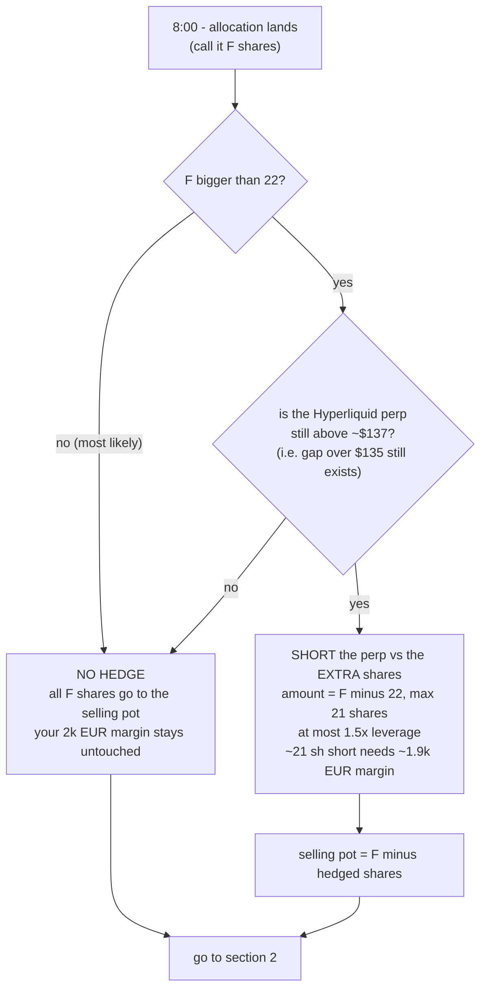
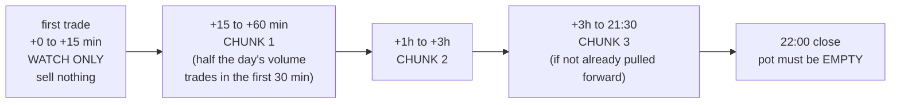
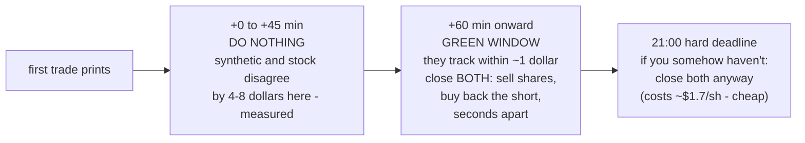
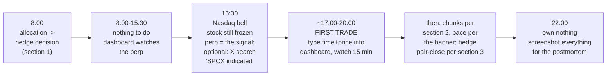

# SPCX Friday Day Card — the whole day on one page

> Hub: [[spcx_listing_day_gameplan]] (full reasoning + thresholds) · [[COWORK]] · [[POLYMARKET_BRAIN]]
> This is the simplified companion: every decision Friday requires, with the jargon unpacked. The dashboard (http://127.0.0.1:8642/) computes all of this live — this card is so you understand what it's telling you.

## Plain-English Summary

- **The price is now official: $135/share.** I bid €10k ≈ **~85 shares requested**. Friday 8:00 I learn how many I actually got. Everything below branches off that one number.
- **Two pots.** If I get more shares than I'm happy holding unhedged (~22 shares ≈ €2.5k), the extra gets **hedged** (a bet against the Hyperliquid synthetic SpaceX, locking ~$25/share profit no matter what). Everything else is the **selling pot**: sold in 2–3 planned chunks into Friday's expected pop.
- **The chunk notation everyone keeps using:** "8/8/5" just means **three separate sell orders** — first 8 shares, later 8 more, finally 5 — placed in time windows after the stock's first trade. "60/40" = two orders of 60% then 40% of the pot. That's all it is.
- **The day's shape (FADE / RALLY / FLAT / CRASH) only changes the *pace*** — sell faster, sell slower, or sell everything — never the plan itself. The dashboard banner names the shape and quotes the rule; this card explains what each one means for your fingers.
- **End of day: own nothing.** Selling pot sold, hedge pair-closed, by 22:00.

---

## 1. The hedge decision (Friday 8:00 — one decision, 60 seconds)

What the hedge *is*, in one sentence: you own shares bought at $135; the synthetic trades around $155–165; betting against the synthetic while holding the shares means whatever happens Friday, you pocket roughly the difference (~$20–30/share on the hedged shares) — **but only if you close both sides properly (section 3)**.

## 2. The selling pot — which chunks, in which windows

Pick your row Friday morning (pot = allocation minus hedged shares). Each chunk = one limit sell order on Trade Republic (€1 each), placed 1–2 cents under the current bid.

| selling pot | chunk 1 | chunk 2 | chunk 3 | read it as |
|---:|---|---|---|---|
| ~9 sh | 5 sh | 4 sh | — | "60/40": two orders, done early |
| ~21 sh | 8 sh | 8 sh | 5 sh | the classic "8/8/5" |
| ~22 sh (e.g. 43 fill, 21 hedged) | 8 sh | 8 sh | 6 sh | "8/8/6" |
| ~43 sh | 17 sh | 17 sh | 9 sh | "17/17/9" |
| ~64 sh (full fill, 21 hedged) | 26 sh | 26 sh | 13 sh | "26/26/13" — place chunk 1 ASAP, it's risk reduction |

**The windows (clock starts at the FIRST TRADE, not at 15:30 — the stock stays frozen for hours after the Nasdaq bell; expect the first trade ~17:00–20:00 CET):**

**How the day's shape changes the pace** (the dashboard banner tells you which one you're in — these are the only four moves):

| banner says | what it means | what you do |
|---|---|---|
| **FADE** (most common — price below its volume-average for 10+ min and well off the high) | the pop is deflating | **speed up**: place the next chunk now, squeeze remaining windows in half. History says the first price was ~89% of the day's best anyway |
| **RALLY** (making new highs) | the pop is still inflating | **slow down**: hold the last chunk, keep a mental "sell all" trigger 10% below the running high, tell Alvaro the tails are getting rich (PEAK) |
| **FLAT** | nothing happening | default windows, be done by ~20:00 |
| **CRASH** (below the first-trade price AND below $160, or any red level) | thesis failing | **sell everything immediately**, marketable orders. Red levels: $140 = reassess · $125 = no questions, all out |

## 3. Unwinding the hedge (only if section 1 said hedge)

The hedge is two positions that cancel: shares (Trade Republic) + a short on the synthetic (Hyperliquid). To cash the locked ~$25/share you must **close both at the same moment** — that's the "pair-close":

Order of operations in the green window: **Trade Republic sell first** (slow venue), then immediately buy back the perp (fast venue). Exception — if the perp's liquidation buffer drops under 25% or the price is moving >2% in 5 minutes: perp first, shares after. The dashboard's hedge chart shows one number for all this: **"close both now = $X"** — when the line's in the green zone and X stops growing (it stops improving after the first hour — measured), take it.

Special case: **no first trade by 20:30** (listing delayed) → just buy back the perp calmly within the hour, keep the shares (your $135 cost basis keeps its value for whenever it lists), done.

## 4. The whole day, one strip

**Inputs you type Friday (everything else is automatic):** allocation count (8:00) · hedge entry if any (8:0x) · first-trade time+price (at the print) · click each chunk "sold" · banner override only if you disagree with it. *Optional, zero decision-weight:* paste an indication range if you happen to catch one on X (`SPCX indicated`, sorted Latest) or CNBC.com's free live blog once the halts poller says the cross is scheduled — the perp is the primary pre-cross signal and is sufficient alone.

> Numbers behind every rule: [[spcx_listing_day_gameplan]] §3 (fill table), §5 (unwind mechanics + S6 measurements), §6 (decision nodes). Not investment advice.
