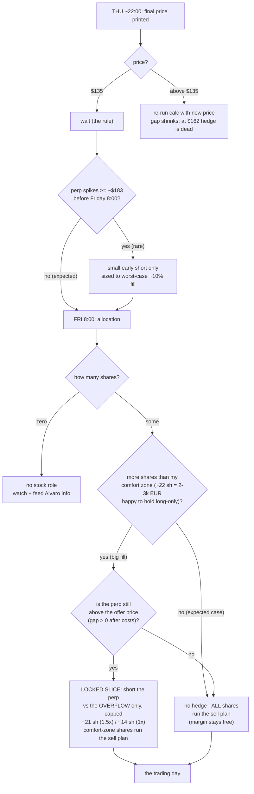
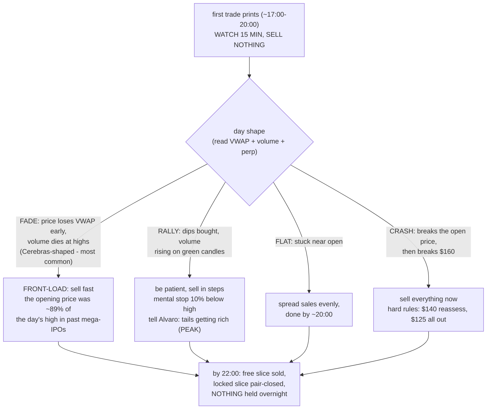

# SPCX Listing-Day Gameplan — Subscription → Pricing → Allocation → Unwind

> Hub: [[spacex_ipo_market_map_handoff]] · [[COWORK]] · [[POLYMARKET_BRAIN]]
> Companions: [[spcx_convergence_calc_findings]] (calculator + Cerebras tape) · [[spacex_ipo_coworker_addendum]] (TR/venue mechanics) · [[2026-06-09_spacex_ipo_convergence_trade]] (session snapshot) · Table terms: [[polymarket_table_dictionary]]
> Coworker input: `SpaceX_Execution_Playbook.docx` (Alvaro, 2026-06-08) — the Polymarket-side + directional-sell playbook this note reconciles with.

## Plain-English Summary

- **What this is.** The stock/perp-side gameplan for Justin's €10k Trade Republic SPCX subscription, from now (Wed Jun 10) through pricing night (Thu), allocation (Fri ~8:00), the Nasdaq IPO cross, and the day-1 unwind — structured as a decision tree with pre-registered rules, plus the research blocks (S1–S4) Claude Code must run before Friday to fill in the open parameters.
- **The reconciliation.** Two strategy frames coexist: the vault's **convergence lock** (long @offer + unlevered short HL perp, hold both to settlement — locked basis, direction-independent) and Alvaro's **sell-the-pop** (no perp, sell tranches into peak euphoria). They are not rivals — they apply to **different slices of the same allocation**. The binding constraint is Justin's free Hyperliquid margin (<€2k): at ≤1.5× leverage that hedges only ~15–22 shares. So the structure is a **two-sleeve plan**: hedge sleeve = min(fill, margin-supported shares) runs the convergence lock; residual sleeve = everything above that runs a hardened version of Alvaro's tranche plan.
- **What changed 2026-06-10 (web-sourced).** Book is now **~4× oversubscribed (~$250B vs $75B)** and institutional books close **today 4pm ET**; the `xyz:SPCX` perp has bled to **~$157 (+16% over offer, vs ~60% in May)** — the basis the calculator gated green is fading in real time. Pricing is **Jun 11**, first trade **Jun 12**.
- **Two corrections to Alvaro's playbook.** (1) **SPCX will not start trading at 15:30 CET.** Nasdaq IPO listings open via a separate **IPO cross** after a quote/display-only period; mega-IPOs historically print their first trade **hours** after the bell (Cerebras: first cash trade 12:59 ET = **18:59 CET**, 3.5h after the open). Plan the day around a 17:00–20:00 CET first print, not 15:30. (2) His "$135 fixed, confirmed in S-1/A" is too strong — the S-1/A is a red-herring; $135 is *expected*, the EU prospectus caps at **$162**, and the binding price lands in the **424B ~Thursday night**. Treat final price as a Thursday-night decision input, not a constant.
- **Cerebras access question — answered.** Cerebras was **not formally institutional-only**, but it had **no retail tranche and no broker retail program**; at ~20× oversubscribed, retail primary fill was negligible and retail's first access was the ~$350 open. SpaceX is structurally opposite (up-to-30% retail reservation + ~55.6M-share EU tranche via Trade Republic) — which is exactly why a basis-preserving long exists here and didn't for Cerebras. Cerebras is a **tape/path analog, not an access analog**.
- **Status (2026-06-10 end of day).** All research blocks are DONE — S1 (hedge rule: wait for allocation), S2 (sell early, the opening price is most of the pop), S3 (which screens to watch), S4 (Trade Republic mechanics), S5 (live crowd dashboard + day-of playbook panel). What remains is human-only: the Trade Republic support chat, and running the day. **Start at §0 below — the whole plan on one page, with the timeline and decision-tree pictures.** Friday-morning live numbers decide everything; nothing here is a commitment to trade.

---

## 0. The plan on one page (start here)

> **Price is OFFICIAL at $135 (Thursday night).** For the simplest possible Friday view — the chunks, the hedge, the unwind, all jargon unpacked — read the companion [[spcx_friday_day_card]]. This section remains the full map.

**What this is, in plain English.** I bid €10,000 for SpaceX shares in the Trade Republic app at the expected price of $135 each. Thursday night the company fixes the real price. Friday at ~8:00 I find out how many shares I actually got (probably only a fraction of what I asked for — demand is ~4× the supply). Friday evening the stock starts trading on Nasdaq, and history says it will open well above $135. My job is to turn the allocated shares into profit that day. Two ways, used together: a **locked slice** — there is a "synthetic SpaceX" contract on Hyperliquid (the `xyz:SPCX` perp) already trading ~$25 above $135; betting *against* it while holding my cheap shares locks that ~$25/share gap in no matter what happens — but my spare Hyperliquid cash (<€2k) only stretches to ~15–21 shares; and a **free slice** — every share beyond that just gets sold into Friday's expected pop, in planned steps, with hard stop-losses if it goes wrong. Alvaro trades the Polymarket side off the same signals.

**The one rule that's already decided (computed, not vibed):** do nothing before Friday's allocation. Hedging early risks betting against shares I never receive; the math says that risk outweighs the gap shrinking while I wait. Sole exception: the perp spiking above ~$183.

### The week, as a timeline

```mermaid
flowchart LR
    A["WED night<br/>TR support chat (8 questions)<br/>brief Alvaro on new findings"] --> B["THU evening<br/>TradingView trial + alerts<br/>start both watchers<br/>~22:00: price news on CNBC/Reuters<br/>re-run the decision calc"]
    B --> C["FRI 8:00<br/>ALLOCATION KNOWN<br/>hedge decision (see tree)"]
    C --> D["FRI 8:00-15:30<br/>perp is the only price<br/>watch dashboard + liq buffer"]
    D --> E["FRI 15:30<br/>Nasdaq bell - SPCX still HALTED<br/>auction warm-up, no trading yet"]
    E --> F["FRI ~17:00-20:00<br/>FIRST TRADE (the cross)<br/>watch 15 min, sell nothing"]
    F --> G["FRI cross to 22:00<br/>sell in steps, front-load if fading<br/>pair-close the hedged slice mid-session"]
    G --> H["FRI 22:00 close<br/>hold NOTHING overnight<br/>Polymarket resolves on this close"]
```

### The decision tree (every branch pre-decided)

### Friday after the first trade — what shape is the day?

How to use this section on the day: the **dashboard's top panel** (Block S5d) walks these same boxes live — it shows which node you're in and what the rule says given the live numbers. This section is the map; the dashboard is the GPS; the sections below are the full reasoning and the exact thresholds.

---

## 1. State of play (2026-06-10, all marks dated)

| item | value | source / freshness |
|---|---|---|
| Offer price | $135 *expected*; EU prospectus max **$162**; binding price in 424B (~Jun 11 night) | EDGAR S-1/A + EU prospectus (see [[2026-06-09_spacex_ipo_convergence_trade]] §4) |
| Book | **~$250B orders vs $75B raise (~4× oversubscribed)**; was ~2× on Jun 8 | Reuters via Coindesk 2026-06-10; Bloomberg 06-08 |
| Institutional books close | **Wed Jun 10, 4pm ET (22:00 CET)** | Bloomberg 06-08 |
| Retail | up to 30% of offering reserved; ~55.6M-share EU tranche; TR pro-rata at offer price | EU prospectus; TR announcement |
| `xyz:SPCX` perp | **~$157**, premium ~**+16%** over $135 (was ~+60% May, ~+18% Jun 9) | Coindesk 2026-06-10 (intraday); refresh via calculator |
| Implied basis (if priced $135) | ~$22/share gross, **compressing ~daily** | perp mark − 135 (xyz is per-share, R=1) |
| Justin's position | €10k TR subscription bid ≈ **~80–90 shares requested** at $135 (FX-dependent) | user |
| Free HL margin | **<€2k** → hedgeable ~**14–15 shares at 1×**, ~**21–22 at 1.5×** (at $157 mark) | user constraint |
| Allocation known | Fri Jun 12 ~**8:00 CET** (TR notification) | TR / Alvaro playbook |
| Nasdaq bell / likely first SPCX print | 15:30 CET / **~17:00–20:00 CET** (IPO cross, see §4) | Nasdaq IPO cross docs; Cerebras precedent 18:59 CET |
| Settlement references | `vntl:SPACEX` cash-settles to first-day **close**; `xyz:SPCX` **converts in place** to an equity perp | trade[XYZ]/Ventuals docs (addendum) |

Column notes: "basis" = perp per-IPO-share-equiv − offer; "hedgeable shares" = margin × leverage / perp mark. Fill scenarios in §3.

**The strategic picture in one line:** the convergence basis still exists but is bleeding out (~60% → ~16% premium in four weeks); meanwhile a 4× book makes both a decent pop *and* a small pro-rata fill more likely. The plan must therefore work in the world where the locked basis on Friday morning is anywhere between ~$0 and ~$20/share.

---

## 2. Two frames, one allocation — the two-sleeve structure

**Frame A — Convergence lock** ([[spcx_convergence_calc_findings]]): long allocated shares at offer, short `xyz:SPCX` FDV-neutral (h=1 on the hedged shares), **unlevered or ≤1.5×**, hold both legs through settlement. Locked P&L = basis × hedged shares, direction-independent. Offline gate is green *at the 06-09 basis*; whether it survives to Friday is live-only.

**Frame B — Sell-the-pop** (Alvaro's playbook): no short; sell allocation in tranches into the post-open euphoria window using tape signals (VWAP, volume divergence, lower lows). Directional — profits iff the stock trades above offer when you sell; the Polymarket tail-selling on Alvaro's side pairs with it.

**Why both, sliced by margin:** with <€2k HL margin, Frame A physically cannot cover more than ~15–22 shares. Anything allocated beyond that is *necessarily* unhedged, i.e. Frame B by construction. The two-sleeve split is therefore not a compromise but the only structure consistent with the constraint:

| sleeve | size | strategy | unwind |
|---|---|---|---|
| **Hedge sleeve** | min(fill, margin-supported shares at ≤1.5×, *if* Friday basis clears the go/no-go) | Frame A: short xyz h=1 against these shares | **Simultaneous pair-close** (§5.1) — not a close-price bet |
| **Residual sleeve** | fill − hedge sleeve (possibly all of fill if basis is gone) | Frame B: hardened Alvaro tranche plan | Tranche sells into strength per §5.2 + S2 schedule |

Consistency note (forcing question discipline): the hedge sleeve makes money even if SPCX never moves; the residual sleeve is an explicit directional bet that the 80% P(close>$135) crowd is right. Holding both is coherent because the residual long was *given* to us at the offer price, not bought at the perp's premium.

---

## 3. Fill scenarios × hedge capacity

€10k ≈ 80–90 shares requested (exact count = €10k × EURUSD / final price — Block S1 takes FX live). Fill fractions are scenarios, not predictions; the 4× headline book is institutional and need not equal retail-tranche oversubscription.

| fill | shares (~) | cash deployed | hedgeable at 1× (~14 sh) | hedgeable at 1.5× (~21 sh) | residual sleeve |
|---:|---:|---:|---|---|---:|
| 10% | 8–9 | ~€1k | full | full | 0 |
| 25% | 20–22 | ~€2.5k | partial (14) | ~full (21) | 0–8 |
| 50% | 40–45 | ~€5k | 14 | 21 | 19–24 |
| 100% | 80–90 | ~€10k | 14 | 21 | 59–69 |

Read: at small fills the entire position can be locked; at large fills the plan is mostly Frame B whatever we decide. The expected case (high oversubscription → fill ≤ ~25%) is *fully hedgeable at ≤1.5×* — the constraint binds only in the high-fill branches, where the extra shares are house-money exposure anyway. *Resolved by S1 + the operator risk input:* the rule is in §6 D2 — hedge only the overflow above the ~22-share comfort zone, capped at the margin ceiling, iff net basis > 0; 1.5× is acceptable (survives the measured 6-IPO melt-up distribution; S1/S2).

---

## 4. How the IPO actually clears (and why Alvaro's clock is wrong)

Mechanics (Nasdaq IPO cross, see sources): the stock is in a **halt state** at the 9:30 ET bell. Nasdaq runs a **quote-only / display-only period** (~15 min minimum, extended in 5-min increments on volatility) during which members enter orders and Nasdaq disseminates the **Net Order Imbalance Indicator (NOII)** — paired shares, imbalance, and an **indicative clearing price** updated every second. The underwriter's stabilization desk (lead left: Goldman/Morgan Stanley) tells Nasdaq when to release; the **IPO cross** then executes as a single bulk print (the Nasdaq Official Opening Price), and continuous trading begins. For large IPOs this release routinely happens **2–4+ hours after the bell** — Cerebras first traded at 12:59 ET (18:59 CET); mega-IPOs historically print late morning–midday ET.

Implications, in order of importance:

1. **Re-anchor the whole afternoon:** allocation 8:00 CET → ~9–11 hours of perp-only signal → bell 15:30 CET (nothing tradable yet) → first print plausibly **17:00–20:00 CET** → close 22:00 CET. The "peak euphoria window" in Alvaro's playbook starts at the *cross*, not at 15:30. With a late cross, the window between first print and close compresses to 2–4 hours — tranche timing must be defined relative to the cross time, not wall-clock (Block S2).
2. **The indicative price is watchable.** During the display-only period the NOII indicative clearing price is the best pre-trade truth — better than the perp, because it aggregates real auction orders. *Resolved by S3:* no practical EU retail access to the official NOII — the pre-registered proxy stack is the xyz perp + CNBC/newswire "indicated to open" headlines (+ the TR/LS pre-cross quote if it exists, HUMAN-CHECK #5). See [[spcx_listing_data_sources]] §2.
3. **Opening-print discipline survives:** do not sell into the first prints. The cross is a single clearing price; immediately after it, spread and volatility are at session max. Alvaro's "observe 10–15 min" rule is right — just starts at ~17:00–20:00 CET.
4. **The perp converges to the indicative, then the print.** Cerebras's perp pre-discovered the open ~2h ahead. From ~16:00 CET the xyz perp + NOII together give a high-quality forecast of the cross price — this is the input for last-minute residual-sleeve sizing decisions and Alvaro's Polymarket entries.

---

## 5. Unwind mechanics, per sleeve

### 5.1 Hedge sleeve — simultaneous pair-close, not a close bet

Because `xyz:SPCX` **converts in place** to a regular equity perp (it does not cash-settle at the close), the lock is realized by closing both legs at the same moment T after the perp tracks the listed stock: sell shares at S(T) on TR, buy back the perp at ~S(T) on HL → total = locked basis regardless of S(T). Rules:

- Wait until perp–spot tracking is confirmed. *S6-calibrated (CBRS 15m-vs-1m tape, n=1 — [[spcx_ipo_unwind_tape_findings]] § Block S6): |gap|≤$2 sustained from **+46 min** post-cross, ≤$1 from **+61 min**; the first ~45 min are a genuine no-pair-close zone (±$4–8 dislocations, perp briefly UNDER spot — benign for the short but unstable). Readiness rule confirmed as written: |gap|≤$2 for 15 min AND ≥60 min post-cross.*
- Pick T for **liquidity, not price**: mid-session after the cross settles (e.g. 1–3h post-print), spreads tight on both venues. Avoid the first 30 min and the closing auction. *S6: measured drag in the 1–3h window sat inside ±$1; patience past +2h bought nothing.*
- Execute the TR sell first (slower venue, limit order), then immediately close the perp (fast venue). Leg risk is seconds-to-minutes of one-sided exposure. **Fast-tape exception (pre-registered judgment, NOT measured — there is no tape to calibrate this):** if the liq buffer is **< 25%** or the stock has moved **> 2% in the last 5 minutes**, reverse the order — close the perp first, then the shares; a few minutes of unhedged long is survivable, a liquidated short is not.
- If using `vntl:SPACEX` instead (thinner; avoid unless xyz is dislocated): it cash-settles to the **close**, so the share leg must be sold **at/near the close** (TR has no MOC order — limit order in the last minutes; slippage vs the official close is a real residual → Block S4 confirms TR's practical latency).
- Liquidation watch runs all day: `spcx_convergence_calc.py --watch` with `--live-entry/--live-short-notional/--live-margin --alert-buffer-pct` + `--parquet-log`. At 1×–1.5× the buffer survives a Cerebras-style +39% spike, but a >+50% freak print during the pre-cross hours is the tail to watch.
- **Forced-flat backstop (hard rule — the day ends holding nothing).** If the pair-close readiness conditions have not confirmed by **21:00 CET**, pair-close anyway at whatever perp–stock gap exists. *S6-calibrated: the measured backstop cost on the CBRS analog was **~$1.7/share** of gap drag (no end-of-session dislocation; worst final-hour |gap| $1.72) — cheap insurance vs an operator-discretionary overnight (trade[XYZ] risk docs: conversion-window mark step-changes "may trigger liquidations"; open-position treatment at conversion is documented nowhere). If the backstop is somehow missed, the n=1 precedent says next-morning recovery is likely cheap (gap held ±$1.2 overnight, funding ~pennies) — at ≤1.5× only; that is a consolation, not a plan.* Sequence under the backstop: TR limit sell (1–2 ticks inside the bid, switch to marketable if unfilled in 5 min) then immediately buy back the perp. **If the listing is postponed or the cross hasn't printed by ~20:30 CET, close the perp short** — *S6-corrected: no same-evening settlement cliff exists (the IPOP survives up to ~60 days past the anticipated date with near-zero damped funding, per the spec index), so a patient limit close within the hour beats "at market immediately"; the reasons to close stand (no same-day convergence event, weekend operator-discretion exposure, margin freed)* — the locked gap survives in the shares (sell them whenever it lists). Either way: perp position = 0 and share position = 0 (or shares-only if no listing) before 22:00.

### 5.2 Residual sleeve — hardened Alvaro plan

Alvaro's 40/40/20 tranche structure, peak signals (volume declining at highs, bearish divergence, VWAP loss, first lower low, spread widening, perp divergence), and hard stops ($140 reassess / $125 sell-everything) are kept, with these hardenings:

- **Clock re-anchored to the cross** (per §4): Phase A = first 10–15 min post-print; Phase B/C windows defined in minutes-since-cross, not CET wall-clock. *S2 calibrated this (2026-06-10, [[spcx_ipo_unwind_tape_findings]]): on the only surviving intraday tape (Cerebras 1m) the volume-weighted peak was +1 min after the cross, anchored VWAP was lost +12 min and never reclaimed, and 52% of day-1 volume traded in the first 30 min; across 6 mega-IPOs the cross print averaged ~89% of the day-1 high. Read: schedule is second-order vs the PEAK signal set; front-load the tranches if anchored VWAP is lost early, and don't carry residual overnight (day-2 closed lower in 5/6).*
- **Limit-order-only** on TR (his rule, kept), 1–2 ticks inside the bid, re-pegged on a 5-min timer.
- **Concrete tranche tables (lean — decided 2026-06-11; a ticket = one manual €1 limit order).** Default phases anchored to the cross: T1 = +15–60 min, T2 = +60–180 min, T3 = +180 min–21:30 CET. By residual-sleeve size: **≤10 sh** → 2 tickets, 60%/40% at T1/T2 (skip T3); **~20 sh** → 8/8/5 (≈Alvaro's 40/40/20); **~40 sh** → 17/17/9; **~65 sh** (100%-fill case, residual > comfort) → 26/26/13 with T1 placed immediately after the 15-min observe window — the first ticket is risk reduction, not price optimization.
- **Day-shape overrides (pre-registered, driven by the S7 classifier states — defined in §5.3):** **FADE** → sell the next tranche now and halve all remaining windows; **RALLY** → defer the final tranche, mental stop 10% below session high, call PEAK check with Alvaro; **CRASH** → sell everything marketable immediately (hard-stop ladder governs); **FLAT** → default pace, done by ~20:00. The classifier labels which row applies; the human can always override it.
- **VWAP from the cross**, not from 15:30 (most charting tools anchor VWAP at 9:30 ET — an IPO needs anchored VWAP from the first print; Block S3 documents how to set this on TradingView).
- **One coordination trigger:** the residual sleeve's "PEAK" call and Alvaro's Polymarket tail-sell should fire on the same signal set — agree the exact definitions pre-session (the playbook's §5.1 list, made binary).
- Fade-risk asymmetry at 4× oversubscription: the bigger the book, the more pre-IPO holders/insiders are *not* sellers day 1 (lockups) but also the hotter the open — S2 should check whether mega-IPO fade size correlates with oversubscription before trusting the -13% fade estimate. *S2 answer: no relation on n=5 (ARM 10×→4% fade but CBRS 20×→19%; the ~SPCX-sized books sat mid-range) — keep −13% as an unconditional prior (sample median ~14%).*

### 5.3 Day-of screen map + indicator set (SUPERSEDED for feeds by [[spcx_listing_data_sources]] §1 — S3's verified runbook; indicator set below remains canonical)

S3 verdicts that overwrite this table's open cells: **no practical EU retail access to the official NOII** (TotalView-only; Webull = NL-only; IBKR ~$15/mo only if a funded account exists) → pre-registered proxy = xyz perp + CNBC/newswire "indicated to open" headlines; **TradingView free tier streams real-time Cboe BZX** (sufficient post-cross; Nasdaq-primary is 15-min delayed; $3/mo add-on needs paid plan/trial → take the 30-day trial Thursday, which also fixes the ~3-alert free cap); anchored VWAP = the free *drawing tool*, click-anchored on the first 1m candle; **Thursday-night final price: newswire beats EDGAR** (424B typically lands Friday pre-market; EDGAR RSS CIK 0001181412 form 424B as backstop).

**Rule zero: Trade Republic is the order-entry venue only, never a price feed or chart.** Its quotes (LS Exchange/Lang & Schwarz mirror) and UX are not built for this; every read happens elsewhere, only the sell tickets happen in TR.

| window (CET) | primary feed | what to read on it |
|---|---|---|
| 8:00–15:30 pre-open | Hyperliquid `xyz:SPCX` (app.hyperliquid.xyz/trade/SPCX, no account needed) + the `--watch` terminal | The only live SpaceX price. Level vs $135/final price; trend into the open; liq-buffer line if short is on |
| 8:00–15:30 | **S5 dashboard** (`spcx_pm_pdf_monitor.py` — built, live-verified) + Polymarket UI | PM-implied close distribution (mean/median/P75/P90), tail prices, perp-vs-crowd gap — Alvaro's entries + our pop prior |
| 15:30→cross (display-only) | **Proxy stack (S3 verdict — official NOII not EU-accessible):** xyz perp + CNBC/newswire "indicated to open" headlines + TR/LS pre-cross quote if quoted (HUMAN-CHECK #5) | Indication range vs perp vs PM mean: the best pre-trade truth about the cross |
| cross→22:00 | TradingView SPCX 1m + 5m (caveat: free tier is 15-min-delayed Nasdaq — S3 confirms cheapest real-time option; a delayed chart is useless on this day) | All indicators below |
| all day | HL perp vs listed price (after cross) | Perp leading down = leveraged money bailing first (early fade warning) |

Indicator set (residual sleeve, all post-cross, all real-time computable — this is Alvaro's §5 list made canonical):

1. **Anchored VWAP from the first print** (not session-anchored 15:30 VWAP) — the primary trend filter; price losing anchored VWAP and failing to reclaim = fade underway → accelerate tranches.
2. **5m volume at highs** — new price high on lower volume than the prior high (bearish divergence) = exhaustion → PEAK candidate.
3. **First lower low on 5m closes** — uptrend structurally broken.
4. **Spread width** — widening bid-ask (e.g. $0.10→$0.50) = market-maker uncertainty.
5. **Perp–spot divergence** — perp dropping while stock holds = sell.
6. **PM tail repricing** — >$2.4T/>$3T YES bids fading = crowd lowering the close → Alvaro signal, shared PEAK trigger.
Buy-side confirmations (hold, don't sell): dips bought within 1–2 min, green-candle volume > red-candle volume, new highs **on** volume spikes, tight spread.

**Day-shape states, computable (pre-registered 2026-06-11 for the S7 classifier — judgment thresholds, sanity-replayed on the CBRS tape but NOT tuned to it; no volume features, IEX coverage is too thin for them):** **CRASH** = price below the cross print AND below $160, or any hard-stop level hit. **FADE** = below anchored VWAP for ≥10 min AND >5% off the session high. **RALLY** = above anchored VWAP AND a new session high within the last 15 min. **FLAT** = none of the above. Hysteresis: a state must hold for 2 consecutive minutes to switch (CRASH switches instantly); manual override always wins; the volume leg of PEAK remains a human TradingView confirm.

PEAK = (2) + any one of (1)/(3)/(5)/(6), pre-agreed with Alvaro as the simultaneous stock-tranche + PM-tail-sell trigger.

### 5.4 Hard risk rules (both sleeves, pre-registered now)

- Perp leverage **≤1.5×**, ever ([[spcx_convergence_calc_findings]] survival math).
- No naked short beyond the pre-hedge rule that S1 outputs; if S1's rule isn't built/green by Thursday night, **no pre-hedge at all** — hedge only after allocation is known.
- If final price prints **>$135**, recompute basis before any hedge (at $162 the basis is roughly gone; auto no-trade for the hedge sleeve unless perp >$170s).
- If Friday-AM net basis < the S1 go/no-go threshold → hedge sleeve = 0, everything runs Frame B.
- Alvaro's $125 hard stop and €3k team max-loss stand unchanged on the residual sleeve.

---

## 6. Decision tree (the gameplan proper)

**D0 — Now → Thu morning (Jun 10–11).** No position. Snapshot the calculator when convenient (cached `latest.json`); continuous `--watch --parquet-log` is NOT required before Friday — S1's decay fit uses HL candle history. The logger becomes mandatory **Thursday evening onward** (pricing-night reaction, allocation morning, in-session liq alarm + funding/oracle/OI capture + purge insurance). Human actions (now fully specified by S3/S4): run the **8-question TR in-app support chat** ([[spcx_trade_republic_execution_findings]] §4 — Q1 flipping + Q2 allocation booking/pre-cross LS quoting are gating; paste answers back into that note). Thursday evening: take the **TradingView 30-day trial** (+$3 Nasdaq add-on, fixes the alert cap), set the S3 alert ladder, set the EDGAR 424B RSS backstop, and start both watchers (`spcx_convergence_calc.py --watch` + `spcx_pm_pdf_monitor.py --watch 45 --parquet-log --html`).

**Thursday dress rehearsal (15:30–22:00 CET, the US session before the day):** run the full stack against a liquid stand-in. Point the dashboard's Alpaca spot WS at AAPL/NVDA, feed fake state (`--fill 40`, mark a pretend cross, bump `--sold` twice) and walk D2→D5 end to end: AVWAP anchors at the first received print, stop-ladder distances move with the tape, tranche phases roll on the clock, pair-close chip logic behaves, browser survives a Wi-Fi toggle and reconnects. (PM/HL panels run on real SPCX simultaneously; crowd-vs-spot numbers will be nonsense with AAPL spot — expected.) Plus two real-world checks: one micro round-trip on TR (~€10 buy + limit sell of anything cheap) to verify the sell-ticket flow and €1 fee semantics, and one TradingView alert fired to the phone to confirm delivery. Nothing untested touches Friday.

**D1 — Pricing night (Thu ~22:00 CET, 424B).** *RESOLVED 2026-06-11 evening: priced **$135** — the basis math holds exactly as computed; the $162 contingency is void; the $183 pre-hedge trigger stands unchanged.*  *S1 resolved this node (2026-06-10 run, perp $162.21/basis ~$27):* **do NOT pre-hedge.** Read the final price, re-run `--decision --offer <final>`, and do nothing — unless the perp has spiked through the frozen trigger **Z\* ≈ $36/sh over a $135 fill (perp ≥ ~$171)**, in which case the pre-hedge tranche opens at pessimistic-fill size only (never above the 10%-fill row of §3). Waiting dominates every pre-node otherwise: decay forfeited (~$1.8–4.3/sh over 2d) ≪ naked-melt-up premium (~$10.6/sh at P(fill≥10%)=0.80) + wait-option value. Assumptions CLI-tunable (`--p-fill`, `--meltup-dist`); *S2 recalibrated the melt-up distribution (2026-06-10, [[spcx_ipo_unwind_tape_findings]] §7): measured day-1 high-vs-offer across 6 mega-IPOs gives `--meltup-dist 0.184:1,0.300:1,0.466:1,0.532:1,0.700:1,1.088:1` (E=+54.5% vs the old +26%), which raises the frozen trigger to **Z\* ≈ $48/sh (perp ≥ ~$183)** — the no-pre-hedge verdict gets strictly stronger. Use this string in the Thursday-night `--decision` re-run.*

**D2 — Allocation (Fri ~8:00 CET).** Read exact share count. *Rule (S1 + operator risk input 2026-06-10: Justin is comfortable carrying €2–3k ≈ ~17–26 shares long-only, so the hedge is an OVERFLOW VALVE, not a default):* hedge sleeve = **clamp(fill − comfort (~22 sh), 0, margin ceiling ~21.4 sh at 1.5× / ~14.3 sh at 1×) iff live net basis > 0** (auto-dead at a $162 print); open the short to h=1 on those shares at 8:00, not later in the morning. Expected-fill case (≤25% ≈ ≤22 sh): **no hedge, margin stays free**. High-fill case (residual still > comfort after the ceiling): front-load the day's first sell tranche as risk reduction. S1's Friday-8:00 projected mark is ~$158–160.4 (rate-only; live premium was below trend and rising — treat as indicative only). Decide residual-sleeve tranche sizes from the §3 row that materialized. Communicate the split to Alvaro (his scenario matrix keys off the same allocation number).

**D3 — Pre-open (Fri 8:30–15:30 CET).** Perp is the only signal; watch level vs $135 and vs the hedge entry. No action except liquidation-buffer monitoring. If the perp collapses to ~$135–140, the pop thesis is weakening: pre-agree with Alvaro what perp level (S1 outputs it) flips the residual sleeve from "sell into strength" to "sell early, risk-off."

**D4 — Display-only period → IPO cross (15:30 → ~17:00–20:00 CET).** Watch the indicative-price **proxy stack** (S3: xyz perp + CNBC/newswire "indicated to open" headlines + TR/LS pre-cross quote if it exists — HUMAN-CHECK #5; official NOII is not EU-retail-accessible) + the S5 monitor's crowd-vs-perp gap. No selling into the cross or first prints. Note cross time and price; start the S2-calibrated tranche clock.

**D5 — Post-cross session → close (cross → 22:00 CET).** Hedge sleeve: pair-close per §5.1 once tracking confirmed and books are deep — and unconditionally by the **21:00 CET forced-flat backstop** (dislocated close beats a naked short; if no cross by ~20:30, close the perp at market and keep only the shares). Residual sleeve: tranches per §5.2 with the peak-signal set; hard stops live. Last 30 min: no new decisions except Alvaro's Polymarket-resolution-driven needs (the close prints his settlement, not ours — our hedged sleeve should already be flat). End state, verified before 22:00: **perp 0, shares 0, nothing overnight.**

**Post-day.** Parquet log + fills → a `spcx_listing_postmortem` findings note; feed realized basis-at-each-node back into the calculator's assumptions ledger.

---

## 7. Research blocks for Claude Code (run before Friday)

All blocks are **independent** (parallelizable) except S1's dependence on the watch-log started at D0. Each lands as a findings note + (where applicable) code under `polymarket/research/`, per [[VAULT_MAP]] § Where to write things. Prompts live in chat per [[COWORK]] § prompt discipline — not committed.

**Block S1 — Hedge grid + pre-hedge timing rule (extends the queued calculator enhancement; highest priority).**
Extend `spcx_convergence_calc.py`: (a) fill-price axis $135→$162 × fill-fraction {10/25/50/100%} × margin constraint (configurable, default €2k ≈ live-FX USD) → hedgeable shares, locked $ and ROC at 1× and 1.5×, per cell; (b) basis-decay model fit on HL hourly/15m candles since mid-May (premium 60%→16%: fit decay rate + uncertainty) — candle history suffices, no live tape required; use any existing `--watch` parquet shards only as a supplementary cross-check; (c) the **pre-hedge timing EV**: for hedge-at-{now, D1, D2} × pessimistic-fill scenarios, EV = P(fill ≥ pre-hedge) × E[basis at that node] − P(shortfall) × E[naked-short loss | melt-up dist from Cerebras analogs], output as a **single pre-registered rule** ("hedge X shares at node Y iff basis ≥ Z"). Acceptance: unit tests extend the existing 11; rule reproduces the trivial corners (zero margin → never; basis 0 → never); a one-page decision table printed by a `--decision` flag. *Deliverable: extend [[spcx_convergence_calc_findings]] + script.* **DONE 2026-06-10** (27 tests green; rule: do NOT pre-hedge, hedge at D2 iff net basis > 0, ceiling ~21.4 sh at 1.5×; trigger raised to ~$183 by S2's measured melt-up dist).

**Block S2 — Unwind schedule from mega-IPO tape.**
Empirical study of listing-day microstructure for Cerebras (HL 15m perp + Yahoo 5m spot already cached) plus as many mega-IPO day-1 tapes as Yahoo/Stooq give at 1–5m (candidates: ARM 2023, Rivian 2021, Alibaba 2014, Facebook 2012, Reddit 2024, Cerebras 2026): minutes-from-first-print to volume-weighted intraday peak, fade onset/depth, % of day-1 volume by 30-min bucket, VWAP-loss timing, and whether a 40/40/20 tranche plan beats TWAP-from-cross and beats sell-at-cross, net of a $0.10–0.50 slippage budget. Lookahead-free: signals computable in real time only. Also: fade size vs oversubscription ratio across the sample (does a 4× book change the prior?). Acceptance: every chart annotated with axes/units/sample; tranche-rule comparison table with CIs across the IPO sample; an explicit "n is tiny, this is calibration not proof" header. *Deliverable: `spcx_ipo_unwind_tape_findings.md` (market_maps) + scripts.* **DONE 2026-06-10 → [[spcx_ipo_unwind_tape_findings]]** (CBRS turned out to have a real 1m tape — cached before Yahoo purges it; the other five degrade to labelled daily-OHLC proxies; policies statistically tied, PEAK signals primary; measured melt-up dist shipped to S1).

**Block S3 — IPO-cross visibility + data-source map (desk research, no code).**
Answer: where can an EU retail trader watch, free or cheaply, (a) the Nasdaq NOII / indicative clearing price during the display-only period, (b) real-time SPCX prints (TradingView free tier = 15-min delayed Nasdaq unless paid/broker feed — confirm; TR app feed latency — confirm), (c) L2 depth (Webull/IBKR/other free options that work in the EU). Document the exact TradingView setup: anchored-VWAP-from-first-print, 1m/5m layout, alert list. Output a one-page "screens" runbook replacing Alvaro's §6 with verified sources. Acceptance: every claim carries a checked URL + date; anything unverifiable marked HUMAN-CHECK. *Deliverable: `spcx_listing_data_sources.md` (market_maps).* **DONE 2026-06-10 → [[spcx_listing_data_sources]]** (no EU NOII access → perp+newswire proxy; TradingView free = real-time Cboe BZX, take the trial Thursday; newswire beats EDGAR for the Thursday price; 7 non-blocking HUMAN-CHECKs).

**Block S4 — Trade Republic execution mechanics (desk research + checklist for the human in-app check).**
Resolve Alvaro's research items 1–10 + 16–17 from published TR docs: order types for US stocks (market/limit/stop; trailing?), partial sells, fractional handling, pre-staging orders before US open, real-time vs delayed quotes, €1 fee semantics, FX conversion timing/spread, T+1 settlement, outage fallbacks (web interface? phone desk?), and any day-1 flipping restriction (none found in published terms as of 06-09 — re-verify). Where docs are silent, output the exact question list for the in-app support chat (human task, D0). Acceptance: table of answer / source / confidence / HUMAN-CHECK flag. *Deliverable: `spcx_trade_republic_execution_findings.md` (market_maps).* **DONE 2026-06-10 → [[spcx_trade_republic_execution_findings]]** (no published flipping rule; no MOC/trailing; EUR-on-LS structure; 8-question in-app chat list — Q1/Q2 gating, human runs it at D0).

**Block S5 — Live PM-PDF + cross-venue implied-price monitor (the one dashboard worth building).**
The convergence `--watch` web dashboard stays declined ([[spcx_convergence_calc_findings]] — infra-before-signal). This is a different object with a live decision attached: on the day, the PEAK call and Alvaro's tail-selling need the **PM-implied closing-cap distribution recomputed continuously** (when the stock rips, the >$2.4T/>$3T tails reprice in minutes — exactly when selling them is the trade), and nobody can refit a PCHIP survivor curve by hand mid-session. Alvaro's playbook lists this as his research items 14–15 and it does not exist yet. Scope (deliberately small): one read-only script, `scripts/spcx_pm_pdf_monitor.py` — poll PM CLOB (16-strike threshold surface + bucket markets, bid/ask not last) and HL `xyz:SPCX` every 30–60s → monotone PCHIP survivor fit → PDF stats (mean/median/mode/P25/P75/P90/P95 in cap *and* per-share on the 13.076B base), bucket-vs-continuous mispricing table (the addendum's $1.5–2.0T diagnostic, live), perp vs PM-mean gap, and after the cross a listed-price input → "what the crowd implies vs where it trades now". Terminal rich-table first; optional `--html` static auto-refresh snapshot (one file, no server) so it's glanceable on a phone/second screen. Append-only parquet log of every poll. **Not** Streamlit, no DB, no `live_trading/` imports. Acceptance: survivor monotonicity enforced + unit-tested; reproduces the addendum's 06-07 table from cached data within tolerance; degrades gracefully when a strike is one-sided/empty; resolves the addendum's open "−$3.3/share EV" sign discrepancy while implementing the EV integral. *Deliverable: script + `spcx_pm_pdf_monitor_findings.md` (market_maps).* **DONE 2026-06-10 → [[spcx_pm_pdf_monitor_findings]]** (live-verified; P(close>$135)=82.2%, mean $167; 1.5–2.0T bucket edge collapsed to +1.5pp; perp now −$3.6 below PM mean; −$3.3 EV line = payoff bug, dead — correct EV +$31.9).

**Block S6 — Perp exit mechanics: calibrate the pair-close window and the forced-flat backstop.**
The §5.1 unwind rules rest on three unmeasured assumptions: (a) the post-cross perp–stock gap is small/stable intraday (the $1–4 figure is from daily closes, not the minute path — the pair-close "readiness" thresholds |gap|≤$2 for 15min / ≥60min post-cross are asserted, not calibrated); (b) a 21:00 forced dislocated close is cheap; (c) holding a short *through* the cash close into `xyz` conversion is dangerous. Calibrate all three: CBRS 15m perp vs 1m/5m spot gap path from cross → close → conversion → +2 days (when was the cheapest buy-back window? any end-of-session dislocation? what did funding and the oracle do at the transition?), plus a close doc-read of trade[XYZ] IPOP conversion/postponement mechanics (funding multiplier 0.005 → standard at what moment; oracle source switch; what happens to open positions if listing slips past the anticipated date). Output: confirmed or corrected §5.1 thresholds + backstop cost estimate + a one-paragraph verdict on "short into conversion: tolerable or never." *Deliverable: § extension of [[spcx_ipo_unwind_tape_findings]] or a short `spcx_perp_exit_mechanics_findings.md` (market_maps).* **DONE 2026-06-11 → [[spcx_ipo_unwind_tape_findings]] § Block S6** (thresholds confirmed: |gap|≤$2 at +46 min / ≤$1 at +61 min, no end-of-session dislocation; backstop ≈$1.7/sh; short into conversion = tolerable on the n=1 tape, never by choice — docs leave open-position treatment at conversion undocumented; postponement urgency softened, ~60d IPOP grace; §5.1 marked *S6-calibrated* in place).

**Friday gate (not a block — the live go/no-go).** Re-run the calculator on Friday-AM marks after allocation: hedge sleeve on **iff fill exceeds the ~22-share comfort zone AND net basis > 0** (the resolved D2 rule); else Frame B only. This gate cannot be pre-computed; it is the whole point of the *terminus = live* rule.

---

## 8. What is already answered (don't re-research)

- **Cerebras retail access:** institutional-skewed in practice, no retail tranche/program, ~20× oversubscribed, retail's first access was the ~$350 open; not formally retail-excluded. Confirmed by vault sources + fresh search (Investing.com, sahmcapital, TECHi, techstackipo). Consequence: the Cerebras convergence trade did not exist for retail; SPCX's is only possible because of the EU tranche.
- **Units/sizing:** xyz is per-share (R=1, basis = mark−135, 1:1 short); vntl is valuation-units (÷$1e9, ~76.5 contracts per 1,000 shares). [[spcx_convergence_calc_findings]] — settled, tested.
- **Leverage:** ≤1.5× or the Cerebras-style spike liquidates the short before it pays. Settled, tested, confirmed on real CBRS tape.
- **Settlement:** vntl → first-day close, cash; xyz → convert-in-place (pair-close unwind, §5.1). From venue docs.
- **$135 not yet binding; $162 EU ceiling; allocation pro-rata, can be ~zero; cash locked during window.** EDGAR + EU prospectus, see snapshot note.

## 9. Sources (fresh, 2026-06-10)

- [Coindesk — SPCX perp down 27% in 3 weeks; 4× oversubscribed; ~$250B book](https://www.coindesk.com/markets/2026/06/10/spacex-s-most-active-pre-ipo-market-has-fallen-27-in-three-weeks)
- [Bloomberg — books close Wednesday](https://www.bloomberg.com/news/articles/2026-06-08/spacex-ipo-is-said-to-be-well-oversubscribed-orders-close-wed) · [Yahoo — order books closing](https://finance.yahoo.com/markets/stocks/articles/spacex-ipo-oversubscribed-order-books-123545689.html) · [Seeking Alpha — 2× (Jun 8)](https://seekingalpha.com/news/4601213-spacex-ipo-over-two-times-oversubscribed)
- [CNBC — fixed $135 roadshow](https://www.cnbc.com/2026/06/03/spacex-ipo-stock-price-roadshow-musk.html) · [CNBC — retail allocation up in the air (Jun 9)](https://www.cnbc.com/2026/06/09/spacex-ipo-explained-stock-price-date.html) · [IPOScoop — $135/$75B](https://www.iposcoop.com/the-ipo-buzz-spacex-spcx-proposed-sets-135-share-ipo-price-to-raise-75-billion/)
- [Nasdaq IPO Cross FAQ (pdf)](https://www.nasdaqtrader.com/content/productsservices/trading/ipohalt/ipo_faq.pdf) · [IPO Cross fact sheet (pdf)](https://www.nasdaqtrader.com/content/productsservices/trading/IPOCross_fs.pdf) · [Nasdaq auction price discovery](https://www.nasdaq.com/articles/automation-and-information-produce-efficient-price-discovery-in-nasdaqs-auction-process)
- [TR IPO access (EQS)](https://www.eqs-news.com/news/corporate/starting-today-trade-republic-gives-european-retail-investors-direct-access-to-ipos/cb7d9263-f112-4539-a30e-2a87dcf950f7_en) · [TR order types](https://support.traderepublic.com/en-de/767-How-can-I-set-a-limit-order)
- Cerebras access: [Investing.com](https://www.investing.com/analysis/cerebras-48-billion-ipo-tests-the-markets-inference-bet-200680080) · [sahmcapital](https://www.sahmcapital.com/news/content/cerebras-ipo-the-market-is-already-mispricing-the-real-risk-2026-05-14) · [TECHi 20× oversubscribed](https://www.techi.com/cerebras-ipo-price-range-bump-150-160/) · [techstackipo trading day](https://www.techstackipo.com/ipo/cerebras/trading-day)

> Not investment advice — structural analysis for a personal-size position. Refresh every number at every decision node.
