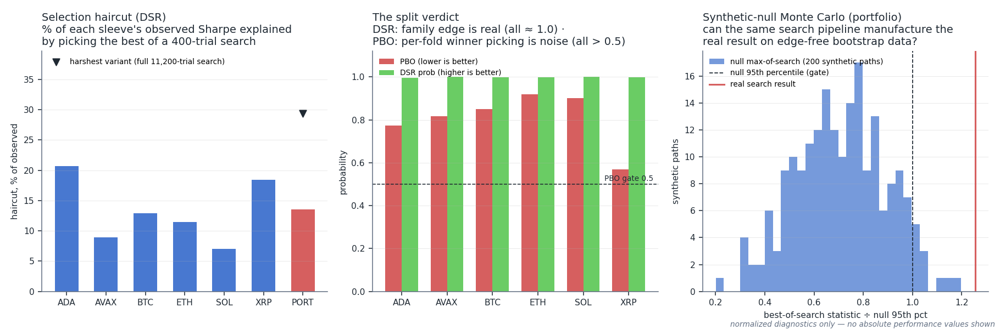

# Momentum CPCV — the toughest validation gate in the repo

This folder is where the live momentum family gets stress-tested with **Combinatorial Purged Cross-Validation (CPCV)**: one notebook per asset, a portfolio aggregation notebook, and the overfitting audit that decides whether a headline number deserves to be believed. Nothing in this repo goes live on the strength of a single backtest — it has to survive this folder first.

## Why CPCV is the strongest test we run

A single train/test split gives you one out-of-sample path and lets one lucky regime decide the verdict. CPCV instead:

- **Splits the sample into N = 8 contiguous groups and tests on every pair** — C(8,2) = **28 train/test splits** per asset, each optimised independently (Optuna TPE, 400 trials per split, same search the live book used).
- **Purges bars at every train/test boundary**, so indicators warmed up on training data can never leak information across the cut.
- **Stitches the test groups into 105 complete out-of-sample equity paths** (every way of pairing 8 groups), giving a *distribution* of OOS outcomes instead of one anecdote. Confidence intervals account for path overlap (effective N, not raw path count).
- **Charges realism everywhere**: 1-bar execution lag and per-leg costs inside the backtester, realised position sizing, and rejection filters identical to the live configuration.

On top of the CPCV runs sits the **overfitting audit** (`run_overfitting_audit.py`, harness in [`infrastructure/validation/`](../../../../infrastructure/README.md)): Deflated Sharpe Ratio with an effective-trial-count correction, Probability of Backtest Overfitting via CSCV (S = 16 blocks → 12,870 in-sample/out-of-sample partitions per asset), White's Reality Check (studentised, 2,000 stationary-bootstrap resamples), minimum track-record length, and a pre-registered three-part gate. The audit replays the full 400-trial search per asset on sample-identical data, so the haircut is computed against the *actual* candidate set the optimiser chose from.

The final layer is a **synthetic-null Monte Carlo** (`run_synthetic_null_mc.py`): 500 block-bootstrap null universes across four null variants — roughly **1.2 million backtests** — asking whether the same search pipeline could have manufactured the real result on edge-free data.

## What the audit found

*Left: the selection haircut — how much of each sleeve's observed result is explained by picking the best of a 400-trial search (shown as % of the observed value; the marker is the harshest full-search variant). Middle: the split verdict — Deflated-Sharpe probability says the family edge is real on every asset, while PBO above the 0.5 gate says the per-fold optimiser winner is systematically *not* the out-of-sample winner. Right: the portfolio's real search result sits beyond the 95th percentile of the synthetic null distribution (x-axis normalized to the null gate). All panels are normalized diagnostics; no absolute performance values are shown.*

The full verdict, assumption ledger, and the re-baselining decisions it triggered are in [momentum_overfitting_audit_findings.md](momentum_overfitting_audit_findings.md). The plain-English explainer of DSR / PBO / Reality Check is [docs/OVERFITTING_VALIDATION.md](../../../../docs/OVERFITTING_VALIDATION.md).

## What's in this folder

| File | Role |
|---|---|
| `cpcv_template.ipynb` | Template notebook — copy and rename per asset; ends with the required overfitting-gate cell |
| `ADA/AVAX/BNB/BTC/ETH/SOL/XRP.ipynb` | Per-asset CPCV notebooks |
| `portfolio_cpcv.ipynb` | Portfolio aggregation over per-asset CPCV results |
| `oos/{sym}usdt_cpcv.pkl` | Per-asset CPCV result artifacts (paths, params, config) |
| `oos/portfolio_cpcv_*.pkl` | Portfolio-level artifacts (paths, CIs, correlations, weights, drawdowns) |
| `run_overfitting_audit.py` | DSR / PBO / Reality-Check audit of the live book (replays the 400-trial search per asset) |
| `oos/overfitting_audit_*.pkl`, `overfitting_audit_summary.csv` | Audit outputs (per-asset stats + portfolio gates) |
| `run_synthetic_null_mc.py` | Synthetic-null Monte Carlo: block-bootstrap null universes vs the real search result |
| `fast_momentum.py` | NumPy port of the strategy (verified output-identical) — makes the MC's ~10⁶ backtests tractable |
| `oos/synthetic_null_mc_*.pkl`, `synthetic_null_mc_summary.csv` | MC outputs (per-variant null distributions, percentiles, gates) |

Engines live in [`infrastructure/walkforward/`](../../../../infrastructure/walkforward/) (`cpcv_engine.py`, `cpcv_portfolio.py`) and the audit harness in [`infrastructure/validation/overfitting_audit.py`](../../../../infrastructure/validation/overfitting_audit.py).

## Adding a new asset

1. Copy `cpcv_template.ipynb` → `{asset}_cpcv.ipynb` (e.g. `btc_cpcv.ipynb`).
2. Paste `strategy_fn`, `PARAM_DEFS`, and `FIXED_PARAMS` from the corresponding walk-forward notebook in `../wf_testing_2/` — these must match exactly; CPCV uses the same function signature.
3. Set `WF_SHARPE` to the combined OOS result from walk-forward (used only as a comparison annotation).
4. Run all cells; results save as `{symbol}_cpcv.pkl`.
5. **Overfitting gate (required before live):** the template's final cells run the audit harness with `collect_trials=True`. The pre-registered gate must pass and the verdict block goes into the strategy's findings note. No strategy graduates to live without it.

Vault hub: docs/STRATEGY_REFERENCE.md
